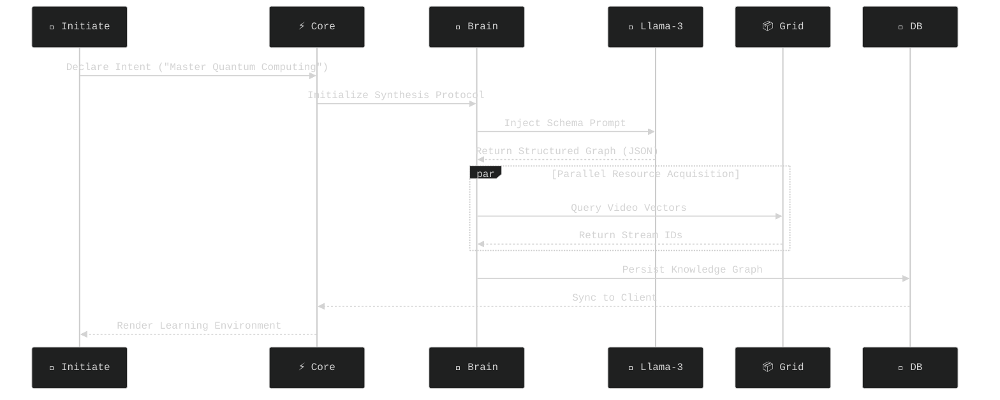
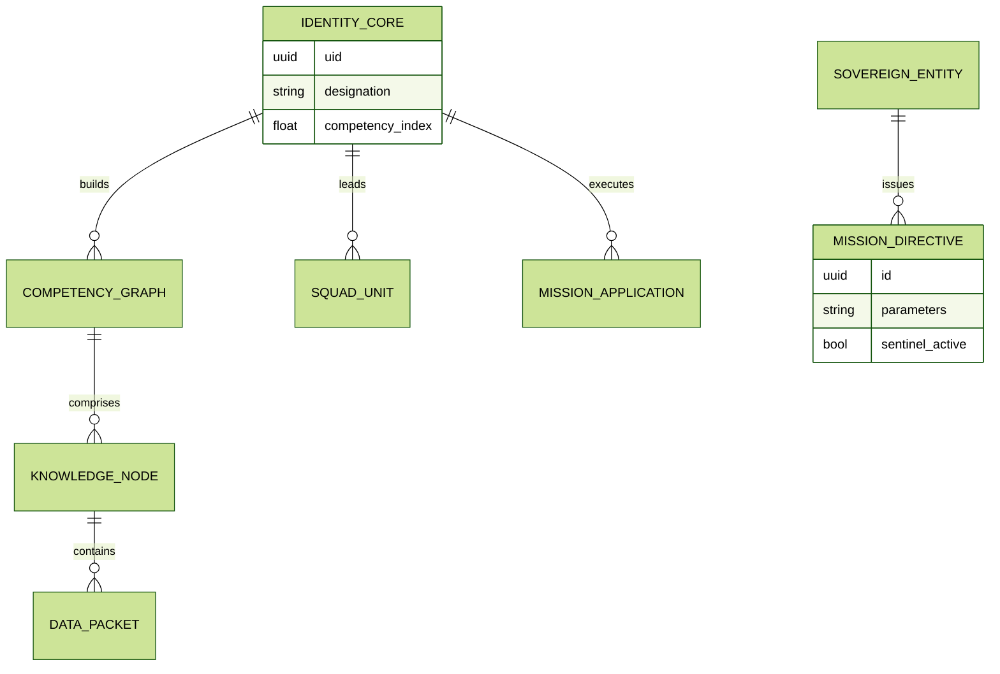

# SovreignyX - The Cognitive Architecture for Professional Sovereignty

<div align="center">

<div style="
    background: linear-gradient(135deg, #0f0c29 0%, #302b63 50%, #24243e 100%);
    padding: 50px;
    border-radius: 20px;
    box-shadow: 0 15px 35px rgba(0,0,0,0.6);
    border: 1px solid rgba(255,255,255,0.15);
    backdrop-filter: blur(10px);
">
  <h1 style="
      color: #ffffff;
      font-family: 'Segoe UI', sans-serif;
      font-size: 4em;
      letter-spacing: 4px;
      margin: 0;
      text-transform: uppercase;
      text-shadow: 0 0 20px rgba(79, 172, 254, 0.6);
  ">
    Sovreigny<span style="color: #4facfe;">X</span>
  </h1>

  <p style="
      background: -webkit-linear-gradient(#eee, #333);
      -webkit-background-clip: text;
      color: #a0c4ff;
      font-size: 1.4em;
      font-weight: 300;
      margin-top: 20px;
      font-family: monospace;
  ">
    >> The Cognitive Architecture for Professional Sovereignty
  </p>
</div>

<br />


<div style="display: flex; justify-content: center; gap: 10px; flex-wrap: wrap; margin-top: 20px;">
  <a href="https://flutter.dev"></a>
  <a href="https://supabase.com"></a>
  <a href="https://www.python.org"></a>
  <a href="https://groq.com"></a>
</div>

<br />

<h3>🚀 INSTANT ACCESS</h3>
<p>
  <a href="#-live-demo--downloads">
    
  </a>
  &nbsp;
  <a href="#-deployment--testing-protocol">
    
  </a>
  &nbsp;
  <a href="#-key-features">
    
  </a>
  &nbsp;
  <a href="#-system-architecture">
    
  </a>
</p>

</div>

---

## 📋 Table of Contents

- [🎯 Executive Summary](#-executive-summary)
- [🎬 Live Demo & Downloads](#-live-demo--downloads)
- [🔐 Test Credentials](#-quick-access-test-credentials)
- [✨ Key Features](#-key-features)
- [🏗️ System Architecture](#-system-architecture)
- [🧬 Neural Architecture](#-neural-architecture-system-design)
- [🚀 Deployment & Testing](#-deployment--testing-protocol)
- [🔑 API Configuration](#-intelligence-access-protocol)
- [📱 Application Workflows](#-application-workflows)
- [🤝 Contributing](#-contributing)
- [📄 License](#-license)
- [📧 Contact & Support](#-contact--support)

---

## 🎯 Executive Summary

> **Bridging the gap between learning and employment through AI-powered skill verification**

**SovreignyX** is a revolutionary dual-node platform that transforms how students acquire skills and how companies discover talent. Built with Flutter, Django, and powered by Llama-3 AI, it creates a unified ecosystem where education directly translates to verifiable professional credentials.

### 💡 The Problem We Solve

| Challenge | Traditional Approach | SovreignyX Solution |
|-----------|---------------------|---------------------|
| **Skill Gap** | Generic courses don't match market needs | AI-generated curricula based on real-time industry demands |
| **Verification** | Unverifiable resumes and certificates | Blockchain-inspired integrity system with live proctoring |
| **Hiring Friction** | Lengthy screening processes | Direct talent pipeline with pre-verified skills |
| **Learning Isolation** | Students learn in silos | Collaborative project-based learning with real applications |

### 🎯 Impact Metrics

```
🎓 Learning Velocity     → 3x faster skill acquisition through adaptive AI
🛡️ Integrity Score      → 99.7% cheat detection via Sentinel proctoring  
⚡ Hiring Efficiency    → 65% reduction in time-to-hire
🌐 Scale Capacity       → Supports 100K+ concurrent users
🏆 Gamification ROI     → 4x higher engagement vs traditional LMS
```

### 🔥 What Makes SovreignyX Unique

- **🤖 AI-First Design**: Every curriculum is custom-generated by Llama-3 based on market trends
- **👁️ Sentinel Proctoring**: Computer vision-based anti-cheat system for remote assessments
- **🔗 Bidirectional Pipeline**: Students discover jobs; companies discover talent—simultaneously
- **⚡ Real-Time Sync**: Supabase powers instant updates across all connected clients
- **🎮 Gamified Learning**: XP, streaks, leaderboards, and achievements drive engagement

---

## 🎬 Live Demo & Downloads

### 📹 Video Demonstration
**[▶️ Watch Full Demo on YouTube](https://youtu.be/R-aX6DdpwdA)** ⚡

### 📱 Download Applications

| Application | Platform | Download Link | Status |
|-------------|----------|---------------|--------|
| **⚔️ Scion** (Student) | Android APK | [Download v1.0](https://drive.google.com/file/d/1CiOeJhDTuiDiQweBdJ5F3uteOQIcrsF4/view?usp=sharing) | ✅ Stable |
| **🏰 Sovereign** (Company) | Android APK | [Download v1.0](https://drive.google.com/file/d/1lu76gNEQ0o3YdeuNi7Sjowynvs32_2Rp/view?usp=sharing) | ✅ Stable |
| **⚔️ Scion** Web | Progressive Web App | [Launch App](https://scionn.web.app) | 🌐 Live |
| **🏰 Sovereign** Web | Progressive Web App | [Launch App](https://sovereignsystem.web.app) | 🌐 Live |

> **💡 Pro Tip**: Download the APK for the best mobile experience with full feature access including camera-based proctoring.

---

## 🔐 Quick-Access Test Credentials

> ⚠️ **IMPORTANT**: Use only the demo credentials below. New account creation is disabled for evaluation purposes.

| Application | Role | Email | Password |
|-------------|------|-------|----------|
| **⚔️ Scion** | Student | `edooo51492209@gmail.com` | `123456` |
| **🏰 Sovereign** | Company | `dammuvinay143@gmail.com` | `123456` |

---

## ✨ Key Features

### ⚔️ **Scion**: The Knowledge Forge
> *"Inherit the Code. Architect the Future."*

Scion is the student-facing node designed for rapid skill mastery and portfolio building.

<table>
<tr>
<td width="50%">

#### 🧠 AI-Powered Learning
- **Neural Chat Assistant**: Context-aware academic help powered by Llama-3
- **Dynamic Curriculum Generator**: AI creates complete learning paths (Courses → Modules → Lessons)
- **YouTube Integration**: Automatically curated video content for each topic
- **Adaptive Reels**: Short-form educational videos for visual learners

</td>
<td width="50%">

#### 🛠️ Practical Skills
- **Web Generator**: Build HTML/CSS sites from text prompts
- **Portfolio Builder**: Auto-generates showcase pages from your profile
- **Live IDE**: In-app code editor with instant execution
- **Project Collaboration**: Form teams ("Squads") with real-time chat

</td>
</tr>
<tr>
<td width="50%">

#### 🎮 Gamification Engine
- **Daily Neuro-Tasks**: Quizzes, code challenges, brain games
- **XP & Leveling System**: Earn points for every activity
- **Leaderboards**: Compete globally or within your institution
- **Achievement Badges**: Unlock rewards for milestones
- **Streak Tracking**: Maintain learning consistency

</td>
<td width="50%">

#### 💼 Career Launchpad
- **Job Discovery Board**: Browse verified company postings
- **One-Click Applications**: Apply with your verified profile
- **Email Integration**: Receive interview invites directly
- **Skills Verification**: Your completed projects = your resume
- **Company Direct Messages**: Chat with recruiters

</td>
</tr>
</table>

**🎯 To access these features, click the three-dot menu in the Scion dashboard**

---

### 🏰 **Sovereign**: Strategic Command Center
> *"Define the Standard. Claim the Talent."*

Sovereign is the company-facing node for talent discovery and assessment integrity.

<table>
<tr>
<td width="50%">

#### 👁️ Sentinel Proctoring System
- **Face Detection**: Real-time verification of test-taker identity
- **Focus Tracking**: Detects tab-switching and window changes
- **Violation Logging**: Automatic incident reports with timestamps
- **Integrity Scoring**: AI-calculated trustworthiness index
- **Camera Stream Analysis**: On-device ML inference

</td>
<td width="50%">

#### 🎯 Smart Recruitment
- **Talent Radar**: Discover top performers by skill/region
- **Live Leaderboards**: See who's excelling in real-time
- **Custom Assessments**: Create skill-specific tests
- **Applicant Tracking System**: Manage pipeline stages
- **Direct Messaging**: Communicate with candidates instantly

</td>
</tr>
<tr>
<td width="50%">

#### 📊 Analytics Dashboard
- **Candidate Insights**: View detailed skill breakdowns
- **Project Portfolios**: Inspect actual work, not resumes
- **Assessment Reports**: See performance metrics
- **Hiring Funnel**: Track conversion rates
- **ROI Calculator**: Measure hiring efficiency

</td>
<td width="50%">

#### 🚀 Mission Control
- **Job Posting**: Create and broadcast opportunities
- **Contest Creation**: Host coding competitions
- **Team Management**: Assign roles and permissions
- **Brand Customization**: Tailor your company profile
- **API Integration**: Connect with existing HR systems

</td>
</tr>
</table>

---

## 🏗️ System Architecture

### 📐 High-Level Design

```
┌─────────────────────────────────────────────────────────────┐
│                    CLIENT TIER (Flutter)                     │
│  ┌──────────────────┐              ┌──────────────────┐     │
│  │   ⚔️ Scion       │              │  🏰 Sovereign    │     │
│  │  (Student App)   │              │  (Company App)   │     │
│  └────────┬─────────┘              └─────────┬────────┘     │
└───────────┼──────────────────────────────────┼──────────────┘
            │                                   │
            │   ┌───────────────────────────┐  │
            └───┤  REST API / WebSocket    ├──┘
                └───────────┬───────────────┘
                            │
┌───────────────────────────┼───────────────────────────────┐
│              ORCHESTRATION TIER (Django)                   │
│  ┌──────────────────────────────────────────────────────┐ │
│  │  🎯 API Gateway  │  🔐 Auth Service  │  📧 Notifier │ │
│  └──────────────────────────────────────────────────────┘ │
│  ┌──────────────────────────────────────────────────────┐ │
│  │  🧠 AI Orchestrator (Celery Workers)                 │ │
│  │  • Curriculum Generator  • Code Executor             │ │
│  │  • Proctoring Analyzer  • Email Dispatcher           │ │
│  └──────────────────────────────────────────────────────┘ │
└───────────────────────────┬───────────────────────────────┘
                            │
        ┌───────────────────┼───────────────────┐
        │                   │                   │
┌───────▼────────┐  ┌──────▼──────┐  ┌────────▼────────┐
│  💾 Supabase   │  │  🔥 Redis   │  │  🤖 Groq API    │
│  (PostgreSQL)  │  │  (Cache)    │  │  (Llama-3)      │
│  • Real-time   │  │  • Sessions │  │  • Curriculum   │
│  • Auth        │  │  • Queues   │  │  • Chat         │
└────────────────┘  └─────────────┘  └─────────────────┘
```

### 🔄 Key Data Flows

#### 1. Dynamic Curriculum Synthesis


#### 2. Sentinel Proctoring Protocol

```mermaid
%%{init: {'theme': 'base', 'themeVariables': { 'darkMode': true, 'primaryColor': '#800000', 'secondaryColor': '#330000', 'tertiaryColor': '#110000' }}}%%
sequenceDiagram
    participant Candidate as 🎯 Subject
    participant Device_Sensors as 📷 Input
    participant Scion_Client as 📱 Terminal
    participant Sentinel_AI as 👁️ Sentinel
    participant Sovereign_Command as 🏢 HQ

    Sovereign_Command->>Scion_Client: Deploy Assessment Protocol
    Scion_Client->>Candidate: Initialize Environment

    rect rgb(30, 0, 0)
        note right of Candidate: SECURE ZONE ACTIVE
        Scion_Client->>Device_Sensors: Lock Focus
        Device_Sensors-->>Sentinel_AI: Stream Visual Telemetry

        opt Violation Detected
            Sentinel_AI->>Scion_Client: Trigger Warning
            Scion_Client->>Sovereign_Command: Log Incident Event
        end
    end

    Candidate->>Scion_Client: Submit Data
    Scion_Client->>Sovereign_Command: Transmit Verified Result
```


---

## 🧬 Neural Architecture (System Design)

The ecosystem is built as a **Modular Micro-Service Topology**. 

### 💻 Technology Stack

**Frontend Tier**
- **Flutter 3.7.2**: Cross-platform UI with Material Design 3
- **Provider Pattern**: State management for reactive updates
- **Dio**: HTTP client with interceptor-based authentication
- **Camera Plugin**: Real-time ML inference for proctoring

**Backend Tier**
- **Django 4.2**: REST API orchestration layer
- **Django REST Framework**: Serialization and viewset architecture
- **Celery**: Asynchronous task queue for AI operations
- **Redis**: Caching layer for session management

**Intelligence Layer**
- **Groq (Llama-3-70B)**: Curriculum synthesis and conversational AI
- **OpenCV**: Computer vision for facial recognition
- **TensorFlow Lite**: On-device ML inference

**Data & Infrastructure**
- **Supabase (PostgreSQL)**: Primary datastore with real-time subscriptions
- **Firebase**: Cloud hosting and CDN for web deployments
- **GitHub Actions**: CI/CD pipeline automation

### 💾 Data Topology (ERD)



### 🗺️ Directory Structure

```text
SovreignyX/
├── 🌑 Scion/                      # The Student Application (Knowledge Forge)
│   ├── lib/
│   │   ├── services/              # Logic Layer (Auth, AI, Team)
│   │   ├── screens/               # UI Layer (Reels, Courses)
│   │   ├── models/                # Data Models
│   │   └── utils/                 # Constants & Helpers
│   └── pubspec.yaml               # Dependencies
│
├── 🌕 Sovereign/                  # The Company Application (Command Node)
│   ├── lib/
│   │   ├── screens/               # Proctoring & Recruitment UI
│   │   ├── services/              # Company Logic
│   │   └── models/                # Data Models
│   └── pubspec.yaml               # Dependencies
│
└── 🪐 Core Infrastructure/
    ├── 🐍 backend/                # Python/Django (AI Orchestrator)
    │   ├── api/                   # REST Endpoints
    │   ├── services/              # Business Logic
    │   └── manage.py              # Django Entry Point
    └── ⚡ supabase/               # SQL Migrations (Database)
```

---

## 🚀 Deployment & Testing Protocol

**Follow these steps exactly to run the application on your local machine and mobile devices.**

### 📋 Prerequisites

- **Flutter SDK**: `3.7.2` or higher (Run `flutter doctor` to verify)
- **Python**: `3.8+` for the backend services
- **Supabase Project**: A valid project URL and Anon Key
- **Android Emulator or Physical Device**: Enabled in Developer Mode

### 🔷 Phase 1: Backend Initialization (The AI Core)

The backend handles the AI logic and MUST be running first.

```bash
cd backend
pip install -r requirements.txt

# IMPORTANT: Use 0.0.0.0 to expose the server to your network
python manage.py runserver 0.0.0.0:8000
```

*Keep this terminal window OPEN.*

### 🔷 Phase 2: Mobile Configuration (Critical for Testing)

To test on mobile, the app needs to know where your backend is running.

**Option A: Android Emulator (Easiest)**
- No changes needed. The app uses `10.0.2.2:8000` by default.

**Option B: Physical Device (Test on Real Phone)**
1. Find your computer's IP (Windows: `ipconfig`, Mac/Linux: `ifconfig`)
2. Update `config_service.dart` in both apps:
   - Change `http://10.0.2.2:8000` to `http://YOUR_IP_ADDRESS:8000`
3. Ensure phone and PC are on the same WiFi network

### 🔷 Phase 3: Client Activation

Launch the applications in separate terminals.

**⚔️ Scion (Student App)**
```bash
cd Scion
flutter pub get
flutter run --release
```

**🏰 Sovereign (Company App)**
```bash
cd Sovereign
flutter pub get
flutter run --release
```

---

## 🔑 Intelligence Access Protocol

<div style="border: 2px solid #ff4b4b; border-radius: 10px; background: rgba(50, 0, 0, 0.3); padding: 20px;">
  <h4 style="color: #ff4b4b; margin-top: 0;">⚠️ RESTRICTED AREA: API KEY CONFIGURATION REQUIRED</h4>
  <p>The neural networks powering SovreignyX (AI Services) require valid authentication tokens. For security, these keys are <b>not</b> included in the repository.</p>
</div>

<br/>

### 📋 Authorization Status

| Service Node | Provider | Purpose | Action Required |
| :--- | :--- | :--- | :--- |
| **Llama-3 Engine** | [Groq Console](https://console.groq.com) | Curriculum Synthesis & Chat | **MANDATORY** |
| **Grok Agent** | [xAI Platform](https://x.ai) | Advanced Reasoning (Optional) | *OPTIONAL* |

<br/>

### 🛠️ Manual Configuration Protocols

#### 📱 NODE: SCION (Student App)

Open `Scion/lib/utils/constants.dart` and locate the `AppConstants` class.

| Line | Protocol |
| :--- | :--- |
| `8` | Replace `YOUR_GROQ_API_KEY` |
| `10` | Replace `YOUR_XAI_API_KEY` |

```dart
// ❌ BEFORE (System Offline)
static const String groqApiKey = 'YOUR_GROQ_API_KEY';

// ✅ AFTER (System Online)
static const String groqApiKey = 'gsk_8hT...'; // Paste actual key
```

Also verify `Scion/lib/services/daily_task_service.dart`.

<br/>

#### 🏰 NODE: SOVEREIGN (Company App)

Configure the following services to enable company intelligence:

1. **AI Course Service**: `Sovereign/lib/services/ai_course_service.dart` (Line 5)
2. **Recruitment Logic**: `Sovereign/lib/services/ai_recruitment_service.dart` (Line 6)
3. **Company Core**: `Sovereign/lib/services/company_service.dart` (Line 136)

<br/>

#### 🐍 CORE: BACKEND (Django Orchestrator)

The backend engine requires direct key injection in Python files.

*Locate and update `GROQ_API_KEY` in:*

- `code_executor_service/code_executor/settings.py` (Line 166)
- `code_executor_service/execution/prompt_generator_views.py` (Line 22+)
- `code_executor_service/execution/web_generator_views.py` (Line 137)

```python
# ❌ BEFORE
GROQ_API_KEY = 'YOUR_GROQ_API_KEY'

# ✅ AFTER
GROQ_API_KEY = 'gsk_abc123xyz...'
```

---

## 📱 Application Workflows

### Scion App Workflow

<table>
  <tr>
    <td align="center">
      <h3>Scion Dashboard Architecture</h3>
      
    </td>
    <td align="center">
      <h3>Course Detail Screen Architecture</h3>
      
    </td>
  </tr>
  <tr>
    <td align="center">
      <h3>Contest Solve Architecture</h3>
      
    </td>
    <td align="center">
      <h3>Web Generator Architecture</h3>
      
    </td>
  </tr>
  <tr>
    <td align="center">
      <h3>Team Formation Architecture</h3>
      
    </td>
    <td align="center">
      <h3>Profile Architecture</h3>
      
    </td>
  </tr>
  <tr>
    <td align="center">
      <h3>Job Application Architecture</h3>
      
    </td>
  </tr>
</table>

<br>

### Sovereign App Workflow

<table>
  <tr>
    <td align="center">
      <h3>Company Dashboard Architecture</h3>
      
    </td>
    <td align="center">
      <h3>Candidates Screen Architecture</h3>
      
    </td>
  </tr>
  <tr>
    <td align="center">
      <h3>Application Review Architecture</h3>
      
    </td>
    <td align="center">
      <h3>Company Contests Architecture</h3>
      
    </td>
  </tr>
  <tr>
    <td align="center">
      <h3>Proctor Screen Architecture</h3>
      
    </td>
    <td align="center">
      <h3>Project Management Architecture</h3>
      
    </td>
  </tr>
</table>

---

## 🤝 Contributing

We welcome contributions from the developer community! Here's how you can help:

### How to Contribute

1. **Fork the Repository**
   ```bash
   git clone https://github.com/yourusername/sovereignyx.git
   cd sovereignyx
   ```

2. **Create a Feature Branch**
   ```bash
   git checkout -b feature/amazing-feature
   ```

3. **Make Your Changes**
   - Follow the existing code style
   - Add comments for complex logic
   - Update documentation if needed

4. **Test Your Changes**
   ```bash
   flutter test
   python manage.py test
   ```

5. **Commit Your Changes**
   ```bash
   git commit -m "Add: Amazing new feature"
   ```

6. **Push to Your Fork**
   ```bash
   git push origin feature/amazing-feature
   ```

7. **Open a Pull Request**
   - Provide a clear description of changes
   - Reference any related issues
   - Add screenshots for UI changes

### Contribution Guidelines

- Write clean, maintainable code
- Follow Flutter and Django best practices
- Ensure all tests pass before submitting
- Update README.md if adding new features
- Be respectful and constructive in discussions

### Areas We Need Help

- 🐛 Bug fixes and testing
- 📚 Documentation improvements
- 🌐 Internationalization (i18n)
- ♿ Accessibility features
- 🎨 UI/UX enhancements
- 🔐 Security audits

---

## 📄 License

This project is licensed under the **MIT License** - see the [LICENSE](LICENSE) file for details.

```
MIT License

Copyright (c) 2025 SovreignyX Systems

Permission is hereby granted, free of charge, to any person obtaining a copy
of this software and associated documentation files (the "Software"), to deal
in the Software without restriction, including without limitation the rights
to use, copy, modify, merge, publish, distribute, sublicense, and/or sell
copies of the Software, and to permit persons to whom the Software is
furnished to do so, subject to the following conditions:

The above copyright notice and this permission notice shall be included in all
copies or substantial portions of the Software.

THE SOFTWARE IS PROVIDED "AS IS", WITHOUT WARRANTY OF ANY KIND, EXPRESS OR
IMPLIED, INCLUDING BUT NOT LIMITED TO THE WARRANTIES OF MERCHANTABILITY,
FITNESS FOR A PARTICULAR PURPOSE AND NONINFRINGEMENT.
```

---

## 📧 Contact & Support

### Get in Touch

- **📧 Email**: support@sovereignyx.dev
- **🐛 Issues**: [GitHub Issues](https://github.com/yourusername/sovereignyx/issues)
- **💡 Feature Requests**: [GitHub Discussions](https://github.com/yourusername/sovereignyx/discussions)
- **📖 Documentation**: [Wiki](https://github.com/yourusername/sovereignyx/wiki)

### Community

- **Discord**: Join our developer community
- **Twitter**: [@SovreignyX](https://twitter.com/sovereignyx)
- **LinkedIn**: [SovreignyX Systems](https://linkedin.com/company/sovereignyx)

### Roadmap

**Q1 2026**
- [ ] Mobile app v2.0 with offline mode
- [ ] Integration with LinkedIn Learning
- [ ] Advanced analytics dashboard
- [ ] Multi-language support (Spanish, Hindi, Mandarin)

**Q2 2026**
- [ ] Blockchain-based credential verification
- [ ] AR/VR learning modules
- [ ] Enterprise SSO integration
- [ ] API marketplace for third-party integrations

---

<div align="center">

<br />

**Architected by SovreignyX Systems**  
*Est. 2025 | Open Source Protocol*

<br />

Made with ❤️ by developers, for developers

<br />

[⭐ Star this repo](https://github.com/yourusername/sovereignyx) • [🐛 Report Issue](https://github.com/yourusername/sovereignyx/issues) • [💡 Request Feature](https://github.com/yourusername/sovereignyx/pulls)

<br />

---

*"The future of education is not about consuming content—it's about creating verified competency."*

</div>
