```mermaid
%%{init: {'theme':'base', 'themeVariables': { 'primaryColor':'#4facfe','primaryTextColor':'#000','primaryBorderColor':'#4facfe','lineColor':'#4facfe','secondaryColor':'#a0c4ff','tertiaryColor':'#fff'}}}%%
sequenceDiagram
    autonumber
    participant U as 👤 User
    participant S as ⚔️ Scion
    participant D as 🐍 Django
    participant C as 🔄 Celery
    participant G as 🤖 Groq
    participant Y as 📺 YouTube
    participant DB as 💾 Supabase

    U->>S: "I want to learn Quantum Computing"
    S->>D: POST /api/v1/courses/generate
    D->>C: Enqueue async task

    Note over C,G: Prompt Engineering Phase
    C->>G: JSON schema + topic
    G->>G: Generate course structure
    G-->>C: {course, modules[], lessons[]}

    par Parallel Resource Fetching
        C->>Y: Search videos for Module 1
        C->>Y: Search videos for Module 2
        C->>Y: Search videos for Module 3
        Y-->>C: Video IDs + metadata
    end

    C->>DB: INSERT course + modules + videos
    DB-->>S: Real-time sync (WebSocket)
    S->>S: Render interactive UI
    S-->>U: "Your course is ready! 🎉"
```

```mermaid
%%{init: {'theme':'base', 'themeVariables': { 'primaryColor':'#6bcf7f','primaryTextColor':'#000','primaryBorderColor':'#6bcf7f','lineColor':'#4facfe'}}}%%
flowchart LR
    A[🏢 Company posts job] --> B[📡 Job syncs to Scion]
    B --> C[👤 Student browses jobs]
    C --> D{Matches skills?}
    D -->|Yes| E[⚡ One-click apply]
    D -->|No| F[💡 Get recommended courses]
    F --> G[📚 Complete learning path]
    G --> E
    E --> H[📧 Company notified]
    H --> I[🏰 Recruiter reviews profile]
    I --> J{Shortlist?}
    J -->|Yes| K[📝 Send assessment]
    J -->|No| L[❌ Reject with feedback]
    K --> M[🎯 Candidate takes test]
    M --> N[👁️ Sentinel monitors]
    N --> O[📊 Results + integrity score]
    O --> P{Pass?}
    P -->|Yes| Q[📞 Schedule interview]
    P -->|No| L
    Q --> R[✅ Hire]

    style A fill:#ff6b6b
    style E fill:#4facfe
    style N fill:#ffd93d
    style R fill:#6bcf7f
```

<div align="center">

<!-- ANIMATED HEADER -->


<!-- TYPING SVG -->
<a href="https://git.io/typing-svg"></a>

<br/>

<!-- SHIELD BADGES WITH ANIMATION -->
<p align="center">
  
  
  
  
</p>

<p align="center">
  
  
  
  
  
</p>

<!-- QUICK ACCESS BUTTONS -->
<p align="center">
  <a href="#-live-demo--downloads">
    
  </a>
  <a href="#-lightning-fast-setup">
    
  </a>
  <a href="#-feature-showcase">
    
  </a>
</p>

<!-- VISUAL DIVIDER -->


</div>

<!-- STATS DASHBOARD -->
<div align="center">

## 📊 Impact at a Glance

<table>
<tr>
<td align="center" width="25%">
<br/>
<b>3x Faster</b><br/>
<sub>Learning Velocity</sub>
</td>
<td align="center" width="25%">
<br/>
<b>99.7%</b><br/>
<sub>Cheat Detection</sub>
</td>
<td align="center" width="25%">
<br/>
<b>65%</b><br/>
<sub>Hiring Speed</sub>
</td>
<td align="center" width="25%">
<br/>
<b>100K+</b><br/>
<sub>User Capacity</sub>
</td>
</tr>
</table>


</div>

<!-- NAVIGATION -->
<div align="center">

<details open>
<summary><h2>🗺️ Navigation Hub</h2></summary>

<table>
<tr>
<td width="33%" align="center">

### 🎯 Getting Started
- [Executive Summary](#-executive-summary)
- [Live Demo](#-live-demo--downloads)
- [Quick Setup](#-lightning-fast-setup)
- [Test Credentials](#-test-credentials)

</td>
<td width="33%" align="center">

### 💎 Core Features
- [Feature Showcase](#-feature-showcase)
- [Scion (Student App)](#️-scion-the-knowledge-forge)
- [Sovereign (Company)](#-sovereign-strategic-command)
- [Workflows](#-application-workflows)

</td>
<td width="33%" align="center">

### 🔧 Technical Deep Dive
- [Architecture](#-system-architecture)
- [Tech Stack](#-technology-stack)
- [API Configuration](#-api-configuration)
- [Contributing](#-contributing)

</td>
</tr>
</table>

</details>


---

## 🎯 Executive Summary

<div align="center">

</div>

<br/>

**SovreignyX** is a revolutionary dual-node platform that transforms how students acquire skills and how companies discover talent. It eliminates the traditional disconnect between learning management systems and recruitment platforms by creating a **unified cognitive architecture** where education directly translates to verifiable professional credentials.

<br/>

### 🔥 The Problem-Solution Matrix

<table>
<tr>
<th width="20%">Challenge</th>
<th width="40%">Traditional Approach</th>
<th width="40%">SovreignyX Solution</th>
</tr>
<tr>
<td align="center">🎓<br/><b>Skill Gap</b></td>
<td>Generic courses that don't match market demands; outdated curriculum</td>
<td><b>AI-Generated Curricula</b> using Llama-3 that adapt to real-time industry trends</td>
</tr>
<tr>
<td align="center">📜<br/><b>Verification</b></td>
<td>Unverifiable resumes and easily forged certificates</td>
<td><b>Sentinel Proctoring</b> with computer vision + blockchain-inspired integrity system</td>
</tr>
<tr>
<td align="center">⏱️<br/><b>Hiring Friction</b></td>
<td>Months-long screening with multiple interview rounds</td>
<td><b>Pre-Verified Talent Pool</b> with instant access to portfolios and assessment scores</td>
</tr>
<tr>
<td align="center">🏝️<br/><b>Learning Isolation</b></td>
<td>Students study alone with no practical application</td>
<td><b>Squad-Based Collaboration</b> with real projects and company challenges</td>
</tr>
</table>

<br/>

### 🚀 What Makes Us Unique

<div align="center">


</div>


---

## 🎬 Live Demo & Downloads

<div align="center">

### 🎥 See It In Action

<a href="https://youtu.be/R-aX6DdpwdA" target="_blank">
  
</a>

<br/><br/>

### 📱 Download & Launch

</div>

<table align="center">
<tr>
<th width="25%">Application</th>
<th width="20%">Platform</th>
<th width="35%">Access Link</th>
<th width="20%">Status</th>
</tr>
<tr>
<td align="center">
<br/>
<b>Scion</b><br/>
<sub>(Student)</sub>
</td>
<td align="center">
<br/>
Android APK
</td>
<td align="center">
<a href="https://drive.google.com/file/d/1CiOeJhDTuiDiQweBdJ5F3uteOQIcrsF4/view?usp=sharing">

</a>
</td>
<td align="center">✅ <b>Stable</b></td>
</tr>
<tr>
<td align="center">
<br/>
<b>Scion</b><br/>
<sub>(Student)</sub>
</td>
<td align="center">
<br/>
Web App
</td>
<td align="center">
<a href="https://scionn.web.app">

</a>
</td>
<td align="center">🌐 <b>Live</b></td>
</tr>
<tr>
<td align="center">
<br/>
<b>Sovereign</b><br/>
<sub>(Company)</sub>
</td>
<td align="center">
<br/>
Android APK
</td>
<td align="center">
<a href="https://drive.google.com/file/d/1lu76gNEQ0o3YdeuNi7Sjowynvs32_2Rp/view?usp=sharing">

</a>
</td>
<td align="center">✅ <b>Stable</b></td>
</tr>
<tr>
<td align="center">
<br/>
<b>Sovereign</b><br/>
<sub>(Company)</sub>
</td>
<td align="center">
<br/>
Web App
</td>
<td align="center">
<a href="https://sovereignsystem.web.app">

</a>
</td>
<td align="center">🌐 <b>Live</b></td>
</tr>
</table>

<div align="center">

> 💡 **Pro Tip:** Download the APK for full mobile experience including camera-based proctoring and offline capabilities!

</div>


---

## 🔐 Test Credentials

<div align="center">

### ⚠️ IMPORTANT NOTICE

<table>
<tr>
<td align="center">

<br/><br/>
<b>Use Demo Credentials Only</b><br/>
New account creation is disabled for evaluation.<br/>
Download the APK for the best experience!
</td>
</tr>
</table>

<br/>

### 🎫 Quick Access Accounts

<table>
<tr>
<th width="20%">Application</th>
<th width="15%">Role</th>
<th width="35%">Email</th>
<th width="15%">Password</th>
<th width="15%">Login</th>
</tr>
<tr>
<td align="center">
<br/>
<b>Scion</b>
</td>
<td align="center">Student</td>
<td><code>edooo51492209@gmail.com</code></td>
<td align="center"><code>123456</code></td>
<td align="center">
<a href="https://scionn.web.app">

</a>
</td>
</tr>
<tr>
<td align="center">
<br/>
<b>Sovereign</b>
</td>
<td align="center">Company</td>
<td><code>dammuvinay143@gmail.com</code></td>
<td align="center"><code>123456</code></td>
<td align="center">
<a href="https://sovereignsystem.web.app">

</a>
</td>
</tr>
</table>

</div>


---

## 💎 Feature Showcase

<div align="center">


</div>

<br/>

<!-- SCION SECTION -->
<details open>
<summary>
<h2>⚔️ Scion: The Knowledge Forge</h2>
</summary>

<div align="center">

> *"Inherit the Code. Architect the Future."*

<br/>

**The student-facing node designed for rapid skill mastery and portfolio building**

<br/>

</div>

### 🧠 AI-Powered Learning Engine

<table>
<tr>
<td width="50%">

#### 🤖 Neural Chat Assistant
- Context-aware academic help powered by **Llama-3**
- Multi-turn conversations with memory
- Code debugging and explanation
- Real-time Q&A support

#### 📚 Dynamic Curriculum Generator
- AI creates complete learning paths
- Structure: **Courses → Modules → Lessons**
- Auto-curated YouTube video content
- Progress tracking and milestones

</td>
<td width="50%">

#### 🎬 Adaptive Reels
- Short-form educational videos (15-60s)
- TikTok-style vertical scrolling
- Topic-specific micro-learning
- Swipe for personalized feed

#### 🔍 Smart Recommendations
- AI analyzes your learning patterns
- Suggests next courses based on trends
- Job-aligned skill paths
- Personalized difficulty scaling

</td>
</tr>
</table>

### 🛠️ Practical Skill Building

<table>
<tr>
<td width="50%">

#### 🌐 Web Page Generator
```
Input: "Create a portfolio site for a photographer"
Output: ✨ Full HTML/CSS/JS code with responsive design
```
- Text-to-website in seconds
- Modern UI templates
- Instant preview and download
- One-click deployment

#### 💼 Portfolio Builder
- Auto-generates showcase pages
- Pulls data from your profile
- Live preview with customization
- Exportable as static site

</td>
<td width="50%">

#### 💻 Live Code Editor
- In-app IDE with syntax highlighting
- Supports Python, Java, JavaScript, C++
- Instant code execution
- Share code snippets with peers

#### 👥 Squad Collaboration
- Form teams of 2-5 members
- Real-time chat and file sharing
- Collaborative project boards
- Peer code reviews

</td>
</tr>
</table>

### 🎮 Gamification System

<div align="center">

<table>
<tr>
<td align="center" width="20%">
<br/>
<b>XP System</b><br/>
<sub>Earn points for every action</sub>
</td>
<td align="center" width="20%">
<br/>
<b>Streaks</b><br/>
<sub>Daily learning consistency</sub>
</td>
<td align="center" width="20%">
<br/>
<b>Leaderboards</b><br/>
<sub>Global & local rankings</sub>
</td>
<td align="center" width="20%">
<br/>
<b>Badges</b><br/>
<sub>Unlock achievements</sub>
</td>
<td align="center" width="20%">
<br/>
<b>Daily Tasks</b><br/>
<sub>Quizzes, code, puzzles</sub>
</td>
</tr>
</table>

</div>

### 💼 Career Launchpad

- **🎯 Job Discovery Board**: Browse verified company postings filtered by skills
- **⚡ One-Click Apply**: Your portfolio IS your resume—no manual uploads
- **📧 Email Integration**: Receive interview invites and updates directly
- **💬 Direct Messaging**: Chat with recruiters without leaving the app
- **✅ Skills Verification**: Every completed project adds to your credibility score

<div align="center">

**🎯 Access Features:** Click the **three-dot menu (⋮)** in the Scion dashboard

</div>

</details>

<br/>

<!-- SOVEREIGN SECTION -->
<details open>
<summary>
<h2>🏰 Sovereign: Strategic Command Center</h2>
</summary>

<div align="center">

> *"Define the Standard. Claim the Talent."*

<br/>

**The company-facing node for talent discovery and assessment integrity**

<br/>

</div>

### 👁️ Sentinel Proctoring System

<div align="center">


</div>

<table>
<tr>
<td width="50%">

#### 🎥 Real-Time Monitoring
- **Face Detection**: Verify candidate identity
- **Focus Tracking**: Detect tab-switching
- **Eye Tracking**: Monitor attention patterns
- **Audio Analysis**: Detect external help

</td>
<td width="50%">

#### 📊 Integrity Scoring
- **Violation Logging**: Timestamped incidents
- **AI Confidence Scores**: 0-100% trustworthiness
- **Video Playback**: Review suspicious moments
- **Automated Reports**: PDF summaries for HR

</td>
</tr>
</table>

### 🎯 Smart Recruitment Dashboard

<table>
<tr>
<td width="50%">

#### 🔍 Talent Radar
- Discover top performers by:
  - **Skill proficiency** (e.g., "Top 5% in Flutter")
  - **Geographic region**
  - **Learning velocity**
  - **Project portfolio quality**
- Live leaderboards with filters
- Bookmark promising candidates

</td>
<td width="50%">

#### 📝 Assessment Builder
- Create custom skill tests
- Question bank with 500+ templates
- Coding challenges with auto-grading
- Video response questions
- Set time limits and difficulty levels

</td>
</tr>
<tr>
<td width="50%">

#### 📈 Applicant Tracking System (ATS)
- Pipeline stages:
  - Applied → Screening → Interview → Offer
- Drag-and-drop candidate management
- Bulk actions (reject, schedule, email)
- Collaboration notes for hiring team

</td>
<td width="50%">

#### 💬 Direct Communication
- In-app messaging with candidates
- Email integration (Gmail, Outlook)
- Interview scheduling with calendar sync
- Automated status updates

</td>
</tr>
</table>

### 📊 Analytics & Insights

<div align="center">

<table>
<tr>
<td align="center" width="25%">
<br/>
<b>Hiring Funnel</b><br/>
<sub>Conversion rate analysis</sub>
</td>
<td align="center" width="25%">
<br/>
<b>Candidate Insights</b><br/>
<sub>Skill breakdown</sub>
</td>
<td align="center" width="25%">
<br/>
<b>Time-to-Hire</b><br/>
<sub>Average days per role</sub>
</td>
<td align="center" width="25%">
<br/>
<b>ROI Calculator</b><br/>
<sub>Cost per hire metrics</sub>
</td>
</tr>
</table>

</div>

</details>


---

## 🏗️ System Architecture

<div align="center">

### 📐 High-Level Design Philosophy


</div>

<br/>

```ascii
┌────────────────────────────────────────────────────────────────┐
│                  CLIENT TIER (Flutter 3.7.2)                   │
│  ┌──────────────────────┐        ┌──────────────────────┐     │
│  │   ⚔️ SCION NODE      │        │  🏰 SOVEREIGN NODE   │     │
│  │   (Student App)       │        │   (Company App)       │     │
│  │  • Material UI        │        │  • Proctoring UI      │     │
│  │  • State Management   │        │  • ATS Dashboard      │     │
│  │  • Camera Integration │        │  • Analytics Panel    │     │
│  └──────────┬───────────┘        └───────────┬──────────┘     │
└─────────────┼───────────────────────────────────┼──────────────┘
              │                                   │
              │      REST API + WebSocket         │
              └──────────────┬────────────────────┘
                             │
┌────────────────────────────┼────────────────────────────────┐
│           ORCHESTRATION TIER (Django 4.2 + DRF)             │
│  ┌──────────────────────────────────────────────────────┐  │
│  │  API Gateway  │  Auth Service  │  Notification Engine │  │
│  └──────────────────────────────────────────────────────┘  │
│  ┌──────────────────────────────────────────────────────┐  │
│  │            AI ORCHESTRATOR (Celery Workers)           │  │
│  │  • Curriculum Generator  • Code Executor             │  │
│  │  • Proctoring Analyzer   • Email Dispatcher          │  │
│  │  • YouTube Fetcher       • Recommendation Engine     │  │
│  └──────────────────────────────────────────────────────┘  │
└────────────────────────────┬────────────────────────────────┘
                             │
        ┌────────────────────┼────────────────────┐
        │                    │                    │
┌───────▼─────────┐  ┌──────▼──────┐  ┌─────────▼─────────┐
│  💾 SUPABASE    │  │  🔥 REDIS   │  │  🤖 GROQ API      │
│  (PostgreSQL)   │  │  (Cache)    │  │  (Llama-3-70B)    │
│  • Real-time    │  │  • Sessions │  │  • Curriculum     │
│  • Row-level    │  │  • Task     │  │  • Chat           │
│    security     │  │    Queues   │  │  • Code Analysis  │
└─────────────────┘  └─────────────┘  └───────────────────┘
```

<br/>

### 🔄 Key Data Flows

<details>
<summary><b>📚 1. Dynamic Curriculum Synthesis Pipeline</b></summary>

<br/>



</details>

<details>
<summary><b>👁️ 2. Sentinel Proctoring Protocol</b></summary>

<br/>


</details>

<details>
<summary><b>💼 3. Job Application Workflow</b></summary>

<br/>



</details>


---

## 💻 Technology Stack

<div align="center">

<table>
<tr>
<td align="center" width="20%">
<br/>
<b>Flutter 3.7.2</b><br/>
<sub>Cross-platform UI</sub>
</td>
<td align="center" width="20%">
<br/>
<b>Django 4.2</b><br/>
<sub>Backend API</sub>
</td>
<td align="center" width="20%">
<br/>
<b>Supabase</b><br/>
<sub>Real-time DB</sub>
</td>
<td align="center" width="20%">
<br/>
<b>Redis</b><br/>
<sub>Caching</sub>
</td>
<td align="center" width="20%">
<br/>
<b>Groq AI</b><br/>
<sub>Llama-3</sub>
</td>
</tr>
</table>

### Detailed Technology Matrix

</div>

<table>
<tr>
<th width="20%">Layer</th>
<th width="40%">Technologies</th>
<th width="40%">Purpose</th>
</tr>
<tr>
<td><b>🎨 Frontend</b></td>
<td>
<code>Flutter 3.7.2</code><br/>
<code>Provider Pattern</code><br/>
<code>Dio HTTP Client</code><br/>
<code>Camera Plugin</code>
</td>
<td>
Cross-platform UI (iOS/Android/Web)<br/>
State management<br/>
API communication<br/>
Proctoring & media capture
</td>
</tr>
<tr>
<td><b>⚙️ Backend</b></td>
<td>
<code>Django 4.2</code><br/>
<code>Django REST Framework</code><br/>
<code>Celery</code><br/>
<code>Redis</code>
</td>
<td>
REST API orchestration<br/>
Serialization & viewsets<br/>
Async task queue<br/>
Caching & session management
</td>
</tr>
<tr>
<td><b>🧠 AI Layer</b></td>
<td>
<code>Groq (Llama-3-70B)</code><br/>
<code>OpenCV</code><br/>
<code>TensorFlow Lite</code>
</td>
<td>
Curriculum synthesis & chat<br/>
Computer vision<br/>
On-device ML inference
</td>
</tr>
<tr>
<td><b>💾 Data</b></td>
<td>
<code>Supabase (PostgreSQL)</code><br/>
<code>Firebase Hosting</code><br/>
<code>GitHub Actions</code>
</td>
<td>
Real-time subscriptions<br/>
CDN & web hosting<br/>
CI/CD automation
</td>
</tr>
</table>

<br/>

### 🗂️ Project Structure
```bash
<div align="center">
SovreignyX/
│
├── 🌑 Scion/                                    # Student Application
│   ├── lib/
│   │   ├── screens/                             # UI Screens
│   │   │   ├── dashboard_screen.dart
│   │   │   ├── course_detail_screen.dart
│   │   │   └── contest_screen.dart
│   │   ├── services/                            # Business Logic
│   │   │   ├── auth_service.dart
│   │   │   ├── ai_service.dart
│   │   │   └── team_service.dart
│   │   ├── models/                              # Data Models
│   │   └── utils/
│   │       ├── constants.dart                   # 🔑 API Keys Here
│   │       └── config_service.dart              # Backend URL
│   └── pubspec.yaml
│
├── 🌕 Sovereign/                                # Company Application
│   ├── lib/
│   │   ├── screens/
│   │   │   ├── company_dashboard.dart
│   │   │   ├── talent_radar_screen.dart
│   │   │   └── proctor_screen.dart
│   │   ├── services/
│   │   │   ├── ai_recruitment_service.dart      # 🔑 API Keys
│   │   │   └── company_service.dart             # 🔑 API Keys
│   │   └── models/
│   └── pubspec.yaml
│
└── 🪐 backend/                                  # Python/Django Backend
    ├── code_executor_service/
    │   ├── settings.py                          # 🔑 API Keys (Line 166)
    │   ├── execution/
    │   │   ├── prompt_generator_views.py        # 🔑 API Keys (Line 22)
    │   │   └── web_generator_views.py           # 🔑 API Keys (Line 137)
    │   └── manage.py
    └── requirements.txt
```
</div>


---

## ⚡ Lightning-Fast Setup

<div align="center">


</div>

<br/>

### 📋 Prerequisites

```bash
✅ Flutter SDK 3.7.2+          → Run: flutter doctor
✅ Python 3.8+                 → Run: python --version
✅ Android Studio / VS Code    → For development
✅ Android Emulator OR         → For testing
   Physical Device (USB Debug enabled)
```

<br/>

### 🔷 Step 1: Backend Initialization

<div align="center">

**⚠️ The backend MUST run first to power AI features**

</div>

```bash
# Navigate to backend directory
cd backend

# Install dependencies
pip install -r requirements.txt

# Run on all network interfaces (IMPORTANT for mobile testing)
python manage.py runserver 0.0.0.0:8000

# ✅ You should see:
# Starting development server at http://0.0.0.0:8000/
```

> 💡 **Keep this terminal window open!** The backend must run continuously.

<br/>

### 🔷 Step 2: Mobile Configuration

<details>
<summary><b>Option A: Android Emulator (Easiest)</b></summary>

<br/>

✅ **No changes needed!** The app uses `10.0.2.2:8000` by default (emulator's localhost).

</details>

<details>
<summary><b>Option B: Physical Device (Real Phone Testing)</b></summary>

<br/>

1. **Find your computer's IP address:**
   ```bash
   # Windows
   ipconfig
   # Look for "IPv4 Address" (e.g., 192.168.1.100)

   # Mac/Linux
   ifconfig
   # Look for "inet" under active network (e.g., 192.168.1.100)
   ```

2. **Update backend URL in apps:**

   **Scion:** `Scion/lib/utils/config_service.dart`
   ```dart
   // Change this line:
   static const String baseUrl = 'http://10.0.2.2:8000';

   // To your computer's IP:
   static const String baseUrl = 'http://192.168.1.100:8000';
   ```

   **Sovereign:** `Sovereign/lib/utils/config_service.dart` (same change)

3. **Ensure phone and PC are on the same WiFi network**

</details>

<br/>

### 🔷 Step 3: Launch Applications

<table>
<tr>
<td width="50%">

#### ⚔️ Launch Scion (Student App)

```bash
cd Scion

# Get dependencies
flutter pub get

# Run on connected device
flutter run --release

# OR specify device
flutter devices  # List devices
flutter run -d <device-id>
```

</td>
<td width="50%">

#### 🏰 Launch Sovereign (Company App)

```bash
cd Sovereign

# Get dependencies
flutter pub get

# Run on connected device
flutter run --release

# OR specify device
flutter devices
flutter run -d <device-id>
```

</td>
</tr>
</table>

<br/>

### ✅ Success Checklist

- [ ] Backend running at `http://0.0.0.0:8000` (terminal shows no errors)
- [ ] Scion app launches and shows login screen
- [ ] Sovereign app launches and shows company login
- [ ] Can log in with test credentials
- [ ] Dashboard loads without errors

<details>
<summary><b>🐛 Troubleshooting Common Issues</b></summary>

<br/>

| Problem | Solution |
|---------|----------|
| `Connection refused` error | Check backend URL in `config_service.dart` matches your IP |
| `No devices found` | Run `flutter doctor` and ensure emulator/USB debugging is enabled |
| `API key missing` | See [API Configuration](#-api-configuration) section |
| Backend crashes | Check `pip install` completed successfully; try `pip install --upgrade -r requirements.txt` |
| Slow loading | Use `--release` mode instead of debug mode |

</details>


---

## 🔑 API Configuration

<div align="center">

<table>
<tr>
<td align="center">

<br/><br/>
<h3>⚠️ CRITICAL: API Keys Required</h3>
For security, API keys are <b>NOT</b> included in the repository.<br/>
You must obtain and configure them manually.
</td>
</tr>
</table>

</div>

<br/>

### 📋 Required Services

<table>
<tr>
<th width="25%">Service</th>
<th width="25%">Provider</th>
<th width="30%">Purpose</th>
<th width="20%">Priority</th>
</tr>
<tr>
<td><b>Groq API</b></td>
<td><a href="https://console.groq.com">console.groq.com</a></td>
<td>Curriculum generation, AI chat, code analysis</td>
<td><span style="color:red">🔴 MANDATORY</span></td>
</tr>
<tr>
<td><b>xAI (Grok)</b></td>
<td><a href="https://x.ai">x.ai</a></td>
<td>Advanced reasoning (optional enhancement)</td>
<td><span style="color:orange">🟡 OPTIONAL</span></td>
</tr>
</table>

<br/>

### 🛠️ Configuration Steps

<details>
<summary><h3>📱 Scion App Configuration</h3></summary>

<br/>

**File:** `Scion/lib/utils/constants.dart`

```dart
class AppConstants {
  // ❌ BEFORE (Non-functional)
  static const String groqApiKey = 'YOUR_GROQ_API_KEY';
  static const String xaiApiKey = 'YOUR_XAI_API_KEY';

  // ✅ AFTER (Replace with your actual keys)
  static const String groqApiKey = 'gsk_abc123xyz...';
  static const String xaiApiKey = 'xai-456def...';  // Optional
}
```

**Also update:** `Scion/lib/services/daily_task_service.dart` (search for API key constants)

</details>

<details>
<summary><h3>🏰 Sovereign App Configuration</h3></summary>

<br/>

Update API keys in these files:

1. **AI Course Service:**  
   `Sovereign/lib/services/ai_course_service.dart` (Line 5)

2. **Recruitment Logic:**  
   `Sovereign/lib/services/ai_recruitment_service.dart` (Line 6)

3. **Company Core:**  
   `Sovereign/lib/services/company_service.dart` (Line 136)

```dart
// Find and replace in each file:
final apiKey = 'YOUR_GROQ_API_KEY';

// With:
final apiKey = 'gsk_abc123xyz...';
```

</details>

<details>
<summary><h3>🐍 Backend Configuration</h3></summary>

<br/>

Update `GROQ_API_KEY` in the following Python files:

1. **Settings:**  
   `code_executor_service/code_executor/settings.py` (Line 166)

2. **Prompt Generator:**  
   `code_executor_service/execution/prompt_generator_views.py` (Line 22+)

3. **Web Generator:**  
   `code_executor_service/execution/web_generator_views.py` (Line 137)

```python
# ❌ BEFORE
GROQ_API_KEY = 'YOUR_GROQ_API_KEY'

# ✅ AFTER
GROQ_API_KEY = 'gsk_abc123xyz...'
```

</details>

<br/>

### ✅ Verification

After configuring, test the AI features:

```bash
# Test curriculum generation
POST http://localhost:8000/api/v1/courses/generate
Body: {"topic": "Python Basics"}

# Expected: JSON with course structure

# Test chat
POST http://localhost:8000/api/v1/chat
Body: {"message": "Explain recursion"}

# Expected: AI-generated response
```


---

## 📱 Application Workflows

<div align="center">


</div>

<br/>

### ⚔️ Scion (Student) Workflows

<details open>
<summary><h3>📊 View All Scion Architecture Diagrams</h3></summary>

<br/>

<table>
  <tr>
    <td align="center" width="50%">
      <h4>🎯 Dashboard Architecture</h4>
      
      <sub>Main hub: Courses, Tasks, Leaderboards, Profile</sub>
    </td>
    <td align="center" width="50%">
      <h4>📚 Course Detail Architecture</h4>
      
      <sub>Curriculum viewer with modules & video player</sub>
    </td>
  </tr>
  <tr>
    <td align="center" width="50%">
      <h4>🏆 Contest Solve Architecture</h4>
      
      <sub>Live proctoring + code editor + submission</sub>
    </td>
    <td align="center" width="50%">
      <h4>🌐 Web Generator Architecture</h4>
      
      <sub>Text-to-website with AI + preview + export</sub>
    </td>
  </tr>
  <tr>
    <td align="center" width="50%">
      <h4>👥 Team Formation Architecture</h4>
      
      <sub>Squad creation, chat, project collaboration</sub>
    </td>
    <td align="center" width="50%">
      <h4>👤 Profile Architecture</h4>
      
      <sub>Skills, XP, badges, portfolio showcase</sub>
    </td>
  </tr>
  <tr>
    <td align="center" width="50%">
      <h4>💼 Job Application Architecture</h4>
      
      <sub>Browse, apply, track status, interview scheduling</sub>
    </td>
    <td align="center" width="50%">
      <br/><br/>
      <h4>📊 Data Flow Summary</h4>
      User Action → Local State → API Call → Backend Processing → Database Update → Real-time Sync → UI Update
    </td>
  </tr>
</table>

</details>

<br/>

### 🏰 Sovereign (Company) Workflows

<details open>
<summary><h3>📊 View All Sovereign Architecture Diagrams</h3></summary>

<br/>

<table>
  <tr>
    <td align="center" width="50%">
      <h4>🏢 Company Dashboard Architecture</h4>
      
      <sub>Metrics, active jobs, applicant pipeline</sub>
    </td>
    <td align="center" width="50%">
      <h4>🎯 Candidates Screen Architecture</h4>
      
      <sub>Talent radar, filters, skill-based search</sub>
    </td>
  </tr>
  <tr>
    <td align="center" width="50%">
      <h4>📋 Application Review Architecture</h4>
      
      <sub>ATS pipeline, notes, scoring, decisions</sub>
    </td>
    <td align="center" width="50%">
      <h4>🏆 Company Contests Architecture</h4>
      
      <sub>Create assessments, set proctoring rules</sub>
    </td>
  </tr>
  <tr>
    <td align="center" width="50%">
      <h4>👁️ Proctor Screen Architecture</h4>
      
      <sub>Live monitoring, violation alerts, recording</sub>
    </td>
    <td align="center" width="50%">
      <h4>📊 Project Management Architecture</h4>
      
      <sub>Job postings, team assignments, analytics</sub>
    </td>
  </tr>
</table>

</details>


---

## 🤝 Contributing

<div align="center">


<br/><br/>

<table>
<tr>
<td align="center" width="33%">
<br/>
<b>Code</b><br/>
<sub>Features, bug fixes, optimizations</sub>
</td>
<td align="center" width="33%">
<br/>
<b>Documentation</b><br/>
<sub>Improve guides, add examples</sub>
</td>
<td align="center" width="33%">
<br/>
<b>Design</b><br/>
<sub>UI/UX enhancements, accessibility</sub>
</td>
</tr>
</table>

</div>

<br/>

### 🚀 How to Contribute

```bash
# 1. Fork & Clone
git clone https://github.com/YOUR_USERNAME/sovereignyx.git
cd sovereignyx

# 2. Create Feature Branch
git checkout -b feature/amazing-feature

# 3. Make Changes & Test
flutter test
python manage.py test

# 4. Commit with Descriptive Message
git commit -m "Add: Amazing feature that does X"

# 5. Push to Your Fork
git push origin feature/amazing-feature

# 6. Open Pull Request on GitHub
```

### 📝 Contribution Guidelines

- ✅ Follow existing code style (Dart: `dart format`, Python: PEP 8)
- ✅ Write meaningful commit messages (`Add:`, `Fix:`, `Update:`, `Refactor:`)
- ✅ Add comments for complex logic
- ✅ Update documentation if adding features
- ✅ Include screenshots for UI changes
- ✅ Ensure all tests pass before submitting
- ✅ Be respectful and constructive in discussions

### 🎯 Areas We Need Help

<table>
<tr>
<td>🐛 <b>Bug Fixes</b></td>
<td>Identify and fix issues; improve error handling</td>
</tr>
<tr>
<td>📚 <b>Documentation</b></td>
<td>Tutorials, API docs, video guides</td>
</tr>
<tr>
<td>🌐 <b>Internationalization</b></td>
<td>Translate to Spanish, Hindi, French, etc.</td>
</tr>
<tr>
<td>♿ <b>Accessibility</b></td>
<td>Screen reader support, keyboard navigation</td>
</tr>
<tr>
<td>🎨 <b>UI/UX</b></td>
<td>Design improvements, dark mode, animations</td>
</tr>
<tr>
<td>🔐 <b>Security</b></td>
<td>Penetration testing, vulnerability reports</td>
</tr>
<tr>
<td>⚡ <b>Performance</b></td>
<td>Optimization, caching strategies, lazy loading</td>
</tr>
</table>

<br/>

### 🏆 Recognition

<div align="center">

All contributors will be featured in our **Hall of Fame** section!

<a href="https://github.com/yourusername/sovereignyx/graphs/contributors">
  
</a>

</div>


---

## 📄 License

<div align="center">


<br/><br/>

This project is licensed under the **MIT License**

<br/>

[](LICENSE)

</div>

```
MIT License

Copyright (c) 2025 SovreignyX Systems

Permission is hereby granted, free of charge, to any person obtaining a copy
of this software and associated documentation files (the "Software"), to deal
in the Software without restriction, including without limitation the rights
to use, copy, modify, merge, publish, distribute, sublicense, and/or sell
copies of the Software, and to permit persons to whom the Software is
furnished to do so, subject to the following conditions:

The above copyright notice and this permission notice shall be included in all
copies or substantial portions of the Software.

THE SOFTWARE IS PROVIDED "AS IS", WITHOUT WARRANTY OF ANY KIND, EXPRESS OR
IMPLIED, INCLUDING BUT NOT LIMITED TO THE WARRANTIES OF MERCHANTABILITY,
FITNESS FOR A PARTICULAR PURPOSE AND NONINFRINGEMENT. IN NO EVENT SHALL THE
AUTHORS OR COPYRIGHT HOLDERS BE LIABLE FOR ANY CLAIM, DAMAGES OR OTHER
LIABILITY, WHETHER IN AN ACTION OF CONTRACT, TORT OR OTHERWISE, ARISING FROM,
OUT OF OR IN CONNECTION WITH THE SOFTWARE OR THE USE OR OTHER DEALINGS IN THE
SOFTWARE.
```


---

## 📧 Contact & Support

<div align="center">

<table>
<tr>
<td align="center" width="25%">
<br/>
<b>GitHub</b><br/>
<a href="https://github.com/yourusername/sovereignyx/issues">Issues</a> • <a href="https://github.com/yourusername/sovereignyx/discussions">Discussions</a>
</td>
<td align="center" width="25%">
<br/>
<b>Email</b><br/>
<a href="mailto:support@sovereignyx.dev">support@sovereignyx.dev</a>
</td>
<td align="center" width="25%">
<br/>
<b>Discord</b><br/>
<a href="#">Join Community</a>
</td>
<td align="center" width="25%">
<br/>
<b>Twitter</b><br/>
<a href="https://twitter.com/sovereignyx">@SovreignyX</a>
</td>
</tr>
</table>

<br/>

### 🗺️ Roadmap

</div>

<table>
<tr>
<th width="15%">Quarter</th>
<th width="85%">Planned Features</th>
</tr>
<tr>
<td align="center"><b>Q1 2026</b></td>
<td>
✅ Mobile app v2.0 with offline mode<br/>
✅ Integration with LinkedIn Learning & Coursera<br/>
✅ Advanced analytics dashboard with predictive hiring<br/>
✅ Multi-language support (Spanish, Hindi, Mandarin)
</td>
</tr>
<tr>
<td align="center"><b>Q2 2026</b></td>
<td>
🚧 Blockchain-based credential verification (NFTs)<br/>
🚧 AR/VR learning modules for immersive education<br/>
🚧 Enterprise SSO integration (Okta, Azure AD)<br/>
🚧 API marketplace for third-party integrations
</td>
</tr>
<tr>
<td align="center"><b>Q3 2026</b></td>
<td>
📋 AI-powered resume builder<br/>
📋 Video interview platform with sentiment analysis<br/>
📋 Company culture matching algorithm<br/>
📋 Mobile app for iOS (currently Android-only)
</td>
</tr>
<tr>
<td align="center"><b>Q4 2026</b></td>
<td>
📋 Marketplace for freelance projects<br/>
📋 Mentorship matching system<br/>
📋 Blockchain salary escrow service<br/>
📋 AI career counselor chatbot
</td>
</tr>
</table>

<br/>

<div align="center">

### 📊 GitHub Stats


<br/><br/>

### ⭐ Star History

[](https://star-history.com/#yourusername/sovereignyx&Date)

<br/><br/>


<br/>

---

<br/>

<table>
<tr>
<td align="center" width="33%">
<a href="https://github.com/yourusername/sovereignyx">

</a>
</td>
<td align="center" width="33%">
<a href="https://github.com/yourusername/sovereignyx/issues">

</a>
</td>
<td align="center" width="33%">
<a href="https://github.com/yourusername/sovereignyx/fork">

</a>
</td>
</tr>
</table>

<br/>

**Architected by SovreignyX Systems**  
*Est. 2025 | Open Source Protocol*

<br/>

Made with ❤️ by developers, for developers

<br/>

---

<br/>

*"The future of education is not about consuming content—*  
*it's about creating verified competency."*

<br/>

</div>

<!-- FOOTER WAVE -->

