```mermaid
%%{init: {'theme':'base', 'themeVariables': { 'primaryColor':'#6bcf7f','primaryTextColor':'#000','primaryBorderColor':'#6bcf7f','lineColor':'#4facfe'}}}%%
flowchart TD
    A[🏢 Company posts job] --> B[📡 Job syncs to Scion]
    B --> C[👤 Student browses jobs]
    C --> D{Matches skills?}
    D -->|Yes| E[⚡ One-click apply]
    D -->|No| F[💡 Get recommended courses]
    F --> G[📚 Complete learning path]
    G --> E
    E --> H[📧 Company notified]
    H --> I[🏰 Recruiter reviews profile]
    I --> J{Shortlist?}
    J -->|Yes| K[📝 Send assessment]
    J -->|No| L[❌ Reject with feedback]
    K --> M[🎯 Candidate takes test]
    M --> N[👁️ Sentinel monitors]
    N --> O[📊 Results + integrity score]
    O --> P{Pass?}
    P -->|Yes| Q[📞 Schedule interview]
    P -->|No| L
    Q --> R[✅ Hire]

    style A fill:#ff6b6b
    style E fill:#4facfe
    style N fill:#ffd93d
    style R fill:#6bcf7f
```

<div align="center">

<!-- ANIMATED HEADER -->


<!-- TYPING SVG -->
<a href="https://git.io/typing-svg">
  
</a>

<br/>

<!-- SHIELD BADGES -->
<p align="center">
  
  
  
  
</p>

<p align="center">
  
  
  
  
  
</p>

<!-- QUICK ACCESS BUTTONS -->
<p align="center">
  <a href="#-live-demo--downloads">
    
  </a>
  <a href="#-lightning-fast-setup">
    
  </a>
  <a href="#-feature-showcase">
    
  </a>
</p>

<!-- VISUAL DIVIDER -->


</div>

## 📋 Table of Contents

- [🎯 Executive Summary](#-executive-summary)
- [📊 Impact Metrics](#-impact-metrics)
- [🎬 Live Demo \& Downloads](#-live-demo--downloads)
- [🔐 Test Credentials](#-test-credentials)
- [✨ Feature Showcase](#-feature-showcase)
  - [⚔️ Scion (Student Node)](#️-scion-the-knowledge-forge)
  - [🏰 Sovereign (Company Node)](#-sovereign-strategic-command)
- [🏗️ System Architecture](#️-system-architecture)
- [💻 Technology Stack](#-technology-stack)
- [⚡ Lightning-Fast Setup](#-lightning-fast-setup)
- [🔑 API Configuration](#-api-configuration)
- [📱 Application Workflows](#-application-workflows)
- [🤝 Contributing](#-contributing)
- [📄 License](#-license)
- [📧 Contact \& Support](#-contact--support)


---

## 🎯 Executive Summary

<div align="center">

**SovreignyX** is a revolutionary dual-node platform that transforms how students acquire skills and how companies discover talent. It eliminates the traditional disconnect between learning management systems and recruitment platforms by creating a **unified cognitive architecture** where education directly translates to verifiable professional credentials.

</div>

### 💡 The Problem-Solution Framework

<table>
<thead>
<tr>
<th width="20%">Challenge</th>
<th width="40%">Traditional Approach</th>
<th width="40%">SovreignyX Solution</th>
</tr>
</thead>
<tbody>
<tr>
<td><strong>🎓 Skill Gap</strong></td>
<td>Generic courses that don't match market demands; outdated curriculum</td>
<td><strong>AI-Generated Curricula</strong> using Llama-3 that adapt to real-time industry trends</td>
</tr>
<tr>
<td><strong>📜 Verification</strong></td>
<td>Unverifiable resumes and easily forged certificates</td>
<td><strong>Sentinel Proctoring</strong> with computer vision + blockchain-inspired integrity system</td>
</tr>
<tr>
<td><strong>⏱️ Hiring Friction</strong></td>
<td>Months-long screening with multiple interview rounds</td>
<td><strong>Pre-Verified Talent Pool</strong> with instant access to portfolios and assessment scores</td>
</tr>
<tr>
<td><strong>🏝️ Learning Isolation</strong></td>
<td>Students study alone with no practical application</td>
<td><strong>Squad-Based Collaboration</strong> with real projects and company challenges</td>
</tr>
</tbody>
</table>

### 🚀 Unique Value Propositions

<table>
<thead>
<tr>
<th width="25%">Feature</th>
<th width="75%">Description</th>
</tr>
</thead>
<tbody>
<tr>
<td><strong>🤖 AI-First Design</strong></td>
<td>Every curriculum is custom-generated by Llama-3 based on market trends, job postings, and skill demand analytics</td>
</tr>
<tr>
<td><strong>👁️ Sentinel Proctoring</strong></td>
<td>Computer vision-based anti-cheat system with face detection, focus tracking, and violation logging for remote assessments</td>
</tr>
<tr>
<td><strong>🔗 Bidirectional Pipeline</strong></td>
<td>Students discover jobs while companies discover talent simultaneously—creating a two-way marketplace</td>
</tr>
<tr>
<td><strong>⚡ Real-Time Sync</strong></td>
<td>Supabase powers instant updates across all connected clients with WebSocket subscriptions</td>
</tr>
<tr>
<td><strong>🎮 Gamified Learning</strong></td>
<td>XP systems, streaks, leaderboards, and achievement badges drive 4x higher engagement vs traditional LMS</td>
</tr>
</tbody>
</table>


---

## 📊 Impact Metrics

<div align="center">

<table>
<thead>
<tr>
<th width="25%">Metric</th>
<th width="25%">Value</th>
<th width="50%">Description</th>
</tr>
</thead>
<tbody>
<tr>
<td align="center"><strong>🚀 Learning Velocity</strong></td>
<td align="center"><h3>3x Faster</h3></td>
<td>Students complete skill acquisition 3x faster through AI-adaptive curriculum and microlearning</td>
</tr>
<tr>
<td align="center"><strong>🛡️ Integrity Score</strong></td>
<td align="center"><h3>99.7%</h3></td>
<td>Cheat detection accuracy via Sentinel proctoring with face recognition and focus tracking</td>
</tr>
<tr>
<td align="center"><strong>⚡ Hiring Efficiency</strong></td>
<td align="center"><h3>65% Reduction</h3></td>
<td>Time-to-hire decreased by 65% through pre-verified candidate portfolios and instant assessments</td>
</tr>
<tr>
<td align="center"><strong>🌐 Scale Capacity</strong></td>
<td align="center"><h3>100K+ Users</h3></td>
<td>Designed to support concurrent users with horizontal scaling and CDN distribution</td>
</tr>
<tr>
<td align="center"><strong>🏆 Engagement ROI</strong></td>
<td align="center"><h3>4x Higher</h3></td>
<td>Gamification drives 4x more daily active usage compared to traditional learning platforms</td>
</tr>
</tbody>
</table>

</div>


---

## 🎬 Live Demo & Downloads

### 📹 Video Demonstration

<div align="center">

<a href="https://youtu.be/R-aX6DdpwdA" target="_blank">
  
</a>

<br/><br/>

*Complete walkthrough of both Scion (Student) and Sovereign (Company) applications*

</div>

### 📱 Download Applications

<table>
<thead>
<tr>
<th width="20%">Application</th>
<th width="15%">Platform</th>
<th width="45%">Access Link</th>
<th width="20%">Status</th>
</tr>
</thead>
<tbody>
<tr>
<td align="center"><strong>⚔️ Scion</strong><br/><sub>(Student)</sub></td>
<td align="center">Android APK</td>
<td align="center">
<a href="https://drive.google.com/file/d/1CiOeJhDTuiDiQweBdJ5F3uteOQIcrsF4/view?usp=sharing">

</a>
</td>
<td align="center">✅ <strong>Stable</strong></td>
</tr>
<tr>
<td align="center"><strong>⚔️ Scion</strong><br/><sub>(Student)</sub></td>
<td align="center">Web App</td>
<td align="center">
<a href="https://scionn.web.app">

</a>
</td>
<td align="center">🌐 <strong>Live</strong></td>
</tr>
<tr>
<td align="center"><strong>🏰 Sovereign</strong><br/><sub>(Company)</sub></td>
<td align="center">Android APK</td>
<td align="center">
<a href="https://drive.google.com/file/d/1lu76gNEQ0o3YdeuNi7Sjowynvs32_2Rp/view?usp=sharing">

</a>
</td>
<td align="center">✅ <strong>Stable</strong></td>
</tr>
<tr>
<td align="center"><strong>🏰 Sovereign</strong><br/><sub>(Company)</sub></td>
<td align="center">Web App</td>
<td align="center">
<a href="https://sovereignsystem.web.app">

</a>
</td>
<td align="center">🌐 <strong>Live</strong></td>
</tr>
</tbody>
</table>

> **💡 Recommendation:** Download the APK for the optimal mobile experience with full feature access including camera-based proctoring and offline capabilities.


---

## 🔐 Test Credentials

> **⚠️ IMPORTANT NOTICE**
> 
> - Use **only** the demo credentials provided below
> - New account creation is **disabled** for evaluation purposes
> - Download the APK for the best user experience

<table>
<thead>
<tr>
<th width="20%">Application</th>
<th width="15%">Role</th>
<th width="35%">Email</th>
<th width="15%">Password</th>
<th width="15%">Quick Login</th>
</tr>
</thead>
<tbody>
<tr>
<td align="center"><strong>⚔️ Scion</strong></td>
<td align="center">Student</td>
<td><code>edooo51492209@gmail.com</code></td>
<td align="center"><code>123456</code></td>
<td align="center">
<a href="https://scionn.web.app">

</a>
</td>
</tr>
<tr>
<td align="center"><strong>🏰 Sovereign</strong></td>
<td align="center">Company</td>
<td><code>dammuvinay143@gmail.com</code></td>
<td align="center"><code>123456</code></td>
<td align="center">
<a href="https://sovereignsystem.web.app">

</a>
</td>
</tr>
</tbody>
</table>


---

## ✨ Feature Showcase

<div align="center">

### Dual-Node Architecture: Student + Company Ecosystems

</div>

### ⚔️ Scion: The Knowledge Forge

> *"Inherit the Code. Architect the Future."*

**The student-facing node designed for rapid skill mastery and portfolio building**

<details open>
<summary><h4>🧠 AI-Powered Learning Engine</h4></summary>

<table>
<thead>
<tr>
<th width="50%">Feature</th>
<th width="50%">Capability</th>
</tr>
</thead>
<tbody>
<tr>
<td><strong>🤖 Neural Chat Assistant</strong></td>
<td>
• Context-aware academic help powered by Llama-3<br/>
• Multi-turn conversations with memory retention<br/>
• Code debugging and explanation<br/>
• Real-time Q&A support with citation links
</td>
</tr>
<tr>
<td><strong>📚 Dynamic Curriculum Generator</strong></td>
<td>
• AI creates complete learning paths<br/>
• Structure: <strong>Courses → Modules → Lessons</strong><br/>
• Auto-curated YouTube video content<br/>
• Progress tracking with completion milestones
</td>
</tr>
<tr>
<td><strong>🎬 Adaptive Reels</strong></td>
<td>
• Short-form educational videos (15-60 seconds)<br/>
• TikTok-style vertical scrolling interface<br/>
• Topic-specific micro-learning content<br/>
• Swipe for personalized content feed
</td>
</tr>
<tr>
<td><strong>🔍 Smart Recommendations</strong></td>
<td>
• AI analyzes learning patterns and preferences<br/>
• Suggests next courses based on market trends<br/>
• Job-aligned skill path recommendations<br/>
• Personalized difficulty scaling
</td>
</tr>
</tbody>
</table>

</details>

<details open>
<summary><h4>🛠️ Practical Skill Building</h4></summary>

<table>
<thead>
<tr>
<th width="50%">Feature</th>
<th width="50%">Capability</th>
</tr>
</thead>
<tbody>
<tr>
<td><strong>🌐 Web Page Generator</strong></td>
<td>
• Text-to-website in seconds<br/>
• Modern UI templates (portfolio, landing, blog)<br/>
• Instant preview and code download<br/>
• One-click deployment to hosting
</td>
</tr>
<tr>
<td><strong>💼 Portfolio Builder</strong></td>
<td>
• Auto-generates showcase pages from profile<br/>
• Live preview with customization options<br/>
• Exportable as static HTML/CSS/JS<br/>
• Shareable portfolio URLs
</td>
</tr>
<tr>
<td><strong>💻 Live Code Editor</strong></td>
<td>
• In-app IDE with syntax highlighting<br/>
• Supports Python, Java, JavaScript, C++<br/>
• Instant code execution with output console<br/>
• Share code snippets with peers
</td>
</tr>
<tr>
<td><strong>👥 Squad Collaboration</strong></td>
<td>
• Form teams of 2-5 members<br/>
• Real-time chat and file sharing<br/>
• Collaborative project boards (Trello-style)<br/>
• Peer code reviews and feedback
</td>
</tr>
</tbody>
</table>

</details>

<details open>
<summary><h4>🎮 Gamification System</h4></summary>

<table>
<thead>
<tr>
<th width="20%">Element</th>
<th width="80%">Description</th>
</tr>
</thead>
<tbody>
<tr>
<td align="center"><strong>🏆 XP System</strong></td>
<td>Earn points for every action: completing lessons (+50 XP), daily tasks (+100 XP), projects (+500 XP), contests (+1000 XP)</td>
</tr>
<tr>
<td align="center"><strong>🔥 Streaks</strong></td>
<td>Maintain daily learning consistency with streak multipliers (7-day streak = 2x XP bonus)</td>
</tr>
<tr>
<td align="center"><strong>📊 Leaderboards</strong></td>
<td>Compete globally, regionally, or within your institution; Weekly, monthly, and all-time rankings</td>
</tr>
<tr>
<td align="center"><strong>🎖️ Achievement Badges</strong></td>
<td>Unlock 50+ badges (First Project, Code Warrior, 100-Day Streak, Top 1%, Team Player)</td>
</tr>
<tr>
<td align="center"><strong>🧠 Daily Neuro-Tasks</strong></td>
<td>Daily quiz (10 questions), code challenge (1 problem), brain game (word puzzle); Complete all 3 = bonus XP</td>
</tr>
</tbody>
</table>

</details>

<details open>
<summary><h4>💼 Career Launchpad</h4></summary>

<table>
<thead>
<tr>
<th width="30%">Feature</th>
<th width="70%">Details</th>
</tr>
</thead>
<tbody>
<tr>
<td><strong>🎯 Job Discovery Board</strong></td>
<td>Browse verified company postings filtered by skills, location, salary range, and experience level</td>
</tr>
<tr>
<td><strong>⚡ One-Click Application</strong></td>
<td>Your portfolio IS your resume—no manual uploads; Auto-filled applications with verified credentials</td>
</tr>
<tr>
<td><strong>📧 Email Integration</strong></td>
<td>Receive interview invites, status updates, and feedback directly in-app and via email</td>
</tr>
<tr>
<td><strong>💬 Direct Messaging</strong></td>
<td>Chat with recruiters without leaving the platform; Message history and notification system</td>
</tr>
<tr>
<td><strong>✅ Skills Verification</strong></td>
<td>Every completed project adds to your credibility score; Companies see verified skills, not claimed skills</td>
</tr>
</tbody>
</table>

</details>

**🎯 Access Features:** Click the **three-dot menu (⋮)** in the Scion dashboard to explore all tools.

---

### 🏰 Sovereign: Strategic Command

> *"Define the Standard. Claim the Talent."*

**The company-facing node for talent discovery and assessment integrity**

<details open>
<summary><h4>👁️ Sentinel Proctoring System</h4></summary>

<table>
<thead>
<tr>
<th width="50%">Component</th>
<th width="50%">Functionality</th>
</tr>
</thead>
<tbody>
<tr>
<td><strong>🎥 Real-Time Monitoring</strong></td>
<td>
• <strong>Face Detection:</strong> Verify candidate identity<br/>
• <strong>Focus Tracking:</strong> Detect tab-switching and window changes<br/>
• <strong>Eye Tracking:</strong> Monitor attention patterns (optional)<br/>
• <strong>Audio Analysis:</strong> Detect external help or suspicious sounds
</td>
</tr>
<tr>
<td><strong>📊 Integrity Scoring</strong></td>
<td>
• <strong>Violation Logging:</strong> Timestamped incident reports<br/>
• <strong>AI Confidence Scores:</strong> 0-100% trustworthiness rating<br/>
• <strong>Video Playback:</strong> Review suspicious moments<br/>
• <strong>Automated Reports:</strong> PDF summaries for HR teams
</td>
</tr>
<tr>
<td><strong>⚠️ Violation Types</strong></td>
<td>
• Face not detected (5+ seconds)<br/>
• Multiple faces in frame<br/>
• Tab switching / window focus lost<br/>
• Screen recording detected<br/>
• Suspicious eye movements
</td>
</tr>
<tr>
<td><strong>🔒 Security Features</strong></td>
<td>
• Fullscreen lock mode<br/>
• Copy-paste disabled<br/>
• Screenshot prevention<br/>
• Browser extension detection<br/>
• Encrypted video streams
</td>
</tr>
</tbody>
</table>

</details>

<details open>
<summary><h4>🎯 Smart Recruitment Dashboard</h4></summary>

<table>
<thead>
<tr>
<th width="50%">Feature</th>
<th width="50%">Description</th>
</tr>
</thead>
<tbody>
<tr>
<td><strong>🔍 Talent Radar</strong></td>
<td>
• Discover top performers by skill proficiency<br/>
• Filter by: Top 5% in Flutter, React, Python, etc.<br/>
• Geographic region and availability filters<br/>
• Learning velocity and project quality metrics<br/>
• Bookmark promising candidates
</td>
</tr>
<tr>
<td><strong>📝 Assessment Builder</strong></td>
<td>
• Create custom skill tests (MCQ, coding, video)<br/>
• Question bank with 500+ pre-built templates<br/>
• Coding challenges with auto-grading<br/>
• Set time limits and difficulty levels<br/>
• AI-generated questions based on job description
</td>
</tr>
<tr>
<td><strong>📈 Applicant Tracking System</strong></td>
<td>
• Pipeline stages: Applied → Screening → Interview → Offer<br/>
• Drag-and-drop candidate management<br/>
• Bulk actions (reject, schedule, email 10+ candidates)<br/>
• Collaboration notes for hiring team<br/>
• Automated status update emails
</td>
</tr>
<tr>
<td><strong>💬 Direct Communication</strong></td>
<td>
• In-app messaging with candidates<br/>
• Email integration (Gmail, Outlook, custom SMTP)<br/>
• Interview scheduling with calendar sync (Google, Outlook)<br/>
• Automated follow-ups and reminders
</td>
</tr>
</tbody>
</table>

</details>

<details open>
<summary><h4>📊 Analytics & Insights</h4></summary>

<table>
<thead>
<tr>
<th width="30%">Metric</th>
<th width="70%">Details</th>
</tr>
</thead>
<tbody>
<tr>
<td><strong>📉 Hiring Funnel</strong></td>
<td>Conversion rate analysis at each stage; Identify bottlenecks in the process; Compare performance across job postings</td>
</tr>
<tr>
<td><strong>👤 Candidate Insights</strong></td>
<td>Skill breakdown with proficiency levels; Project portfolio with GitHub integration; Assessment scores and integrity reports; Engagement metrics (response time, activity level)</td>
</tr>
<tr>
<td><strong>⏱️ Time-to-Hire</strong></td>
<td>Average days per role; Track from job posting to offer acceptance; Compare against industry benchmarks; Identify fastest hiring channels</td>
</tr>
<tr>
<td><strong>💰 ROI Calculator</strong></td>
<td>Cost per hire metrics; Quality of hire analysis (performance after 90 days); Source effectiveness (job boards vs direct applications); Budget allocation recommendations</td>
</tr>
</tbody>
</table>

</details>


---

## 🏗️ System Architecture

### High-Level Design

```
┌────────────────────────────────────────────────────────────────┐
│                  CLIENT TIER (Flutter 3.7.2)                   │
│  ┌──────────────────────┐        ┌──────────────────────┐     │
│  │   ⚔️ SCION NODE      │        │  🏰 SOVEREIGN NODE   │     │
│  │   (Student App)       │        │   (Company App)       │     │
│  │  • Material Design 3  │        │  • Proctoring UI      │     │
│  │  • Provider Pattern   │        │  • ATS Dashboard      │     │
│  │  • Camera Integration │        │  • Analytics Panel    │     │
│  └──────────┬───────────┘        └───────────┬──────────┘     │
└─────────────┼───────────────────────────────────┼──────────────┘
              │                                   │
              │      REST API + WebSocket         │
              └──────────────┬────────────────────┘
                             │
┌────────────────────────────┼────────────────────────────────┐
│           ORCHESTRATION TIER (Django 4.2 + DRF)             │
│  ┌──────────────────────────────────────────────────────┐  │
│  │  API Gateway  │  Auth Service  │  Notification Engine │  │
│  └──────────────────────────────────────────────────────┘  │
│  ┌──────────────────────────────────────────────────────┐  │
│  │            AI ORCHESTRATOR (Celery Workers)           │  │
│  │  • Curriculum Generator  • Code Executor             │  │
│  │  • Proctoring Analyzer   • Email Dispatcher          │  │
│  │  • YouTube Fetcher       • Recommendation Engine     │  │
│  └──────────────────────────────────────────────────────┘  │
└────────────────────────────┬────────────────────────────────┘
                             │
        ┌────────────────────┼────────────────────┐
        │                    │                    │
┌───────▼─────────┐  ┌──────▼──────┐  ┌─────────▼─────────┐
│  💾 SUPABASE    │  │  🔥 REDIS   │  │  🤖 GROQ API      │
│  (PostgreSQL)   │  │  (Cache)    │  │  (Llama-3-70B)    │
│  • Real-time    │  │  • Sessions │  │  • Curriculum     │
│  • Row-level    │  │  • Task     │  │  • Chat           │
│    security     │  │    Queues   │  │  • Code Analysis  │
└─────────────────┘  └─────────────┘  └───────────────────┘
```

### Key Data Flows

```mermaid
%%{init: {'theme':'base', 'themeVariables': { 'primaryColor':'#4facfe','primaryTextColor':'#000','primaryBorderColor':'#4facfe','lineColor':'#4facfe','secondaryColor':'#a0c4ff','tertiaryColor':'#fff'}}}%%
sequenceDiagram
    autonumber
    participant U as 👤 User
    participant S as ⚔️ Scion
    participant D as 🐍 Django
    participant C as 🔄 Celery
    participant G as 🤖 Groq
    participant Y as 📺 YouTube
    participant DB as 💾 Supabase

    U->>S: "I want to learn Quantum Computing"
    S->>D: POST /api/v1/courses/generate
    D->>C: Enqueue async task

    Note over C,G: Prompt Engineering Phase
    C->>G: JSON schema + topic
    G->>G: Generate course structure
    G-->>C: {course, modules[], lessons[]}

    par Parallel Resource Fetching
        C->>Y: Search videos for Module 1
        C->>Y: Search videos for Module 2
        C->>Y: Search videos for Module 3
        Y-->>C: Video IDs + metadata
    end

    C->>DB: INSERT course + modules + videos
    DB-->>S: Real-time sync (WebSocket)
    S->>S: Render interactive UI
    S-->>U: "Your course is ready! 🎉"
```

<details>
<summary><h4>📚 Dynamic Curriculum Synthesis Pipeline</h4></summary>



</details>

<details>
<summary><h4>👁️ Sentinel Proctoring Protocol</h4></summary>


</details>

<details>
<summary><h4>💼 Job Application Workflow</h4></summary>



</details>


---

## 💻 Technology Stack

<table>
<thead>
<tr>
<th width="20%">Layer</th>
<th width="40%">Technologies</th>
<th width="40%">Purpose</th>
</tr>
</thead>
<tbody>
<tr>
<td><strong>🎨 Frontend</strong></td>
<td>
• <code>Flutter 3.7.2</code><br/>
• <code>Provider Pattern</code><br/>
• <code>Dio HTTP Client</code><br/>
• <code>Camera Plugin</code>
</td>
<td>
Cross-platform UI (iOS/Android/Web)<br/>
State management for reactive updates<br/>
API communication with interceptors<br/>
Proctoring & media capture
</td>
</tr>
<tr>
<td><strong>⚙️ Backend</strong></td>
<td>
• <code>Django 4.2</code><br/>
• <code>Django REST Framework</code><br/>
• <code>Celery</code><br/>
• <code>Redis</code>
</td>
<td>
REST API orchestration layer<br/>
Serialization & viewset architecture<br/>
Asynchronous task queue for AI operations<br/>
Caching & session management
</td>
</tr>
<tr>
<td><strong>🧠 AI Layer</strong></td>
<td>
• <code>Groq (Llama-3-70B)</code><br/>
• <code>OpenCV</code><br/>
• <code>TensorFlow Lite</code>
</td>
<td>
Curriculum synthesis & conversational AI<br/>
Computer vision for facial recognition<br/>
On-device ML inference for proctoring
</td>
</tr>
<tr>
<td><strong>💾 Data</strong></td>
<td>
• <code>Supabase (PostgreSQL)</code><br/>
• <code>Firebase Hosting</code><br/>
• <code>GitHub Actions</code>
</td>
<td>
Real-time subscriptions with WebSocket<br/>
CDN & web hosting for PWA<br/>
CI/CD automation pipeline
</td>
</tr>
</tbody>
</table>

### Project Structure

```bash
SovreignyX/
│
├── ⚔️ Scion/                         # Student Application
│   ├── lib/
│   │   ├── screens/                  # UI Screens
│   │   │   ├── dashboard_screen.dart
│   │   │   ├── course_detail_screen.dart
│   │   │   ├── contest_screen.dart
│   │   │   └── job_board_screen.dart
│   │   ├── services/                 # Business Logic
│   │   │   ├── auth_service.dart
│   │   │   ├── ai_service.dart
│   │   │   ├── team_service.dart
│   │   │   └── daily_task_service.dart
│   │   ├── models/                   # Data Models
│   │   └── utils/
│   │       ├── constants.dart        # 🔑 API Keys (Line 8, 10)
│   │       └── config_service.dart   # Backend URL Configuration
│   └── pubspec.yaml                  # Dependencies
│
├── 🏰 Sovereign/                     # Company Application
│   ├── lib/
│   │   ├── screens/
│   │   │   ├── company_dashboard.dart
│   │   │   ├── talent_radar_screen.dart
│   │   │   ├── proctor_screen.dart
│   │   │   └── applicant_review_screen.dart
│   │   ├── services/
│   │   │   ├── ai_course_service.dart        # 🔑 API Keys (Line 5)
│   │   │   ├── ai_recruitment_service.dart   # 🔑 API Keys (Line 6)
│   │   │   └── company_service.dart          # 🔑 API Keys (Line 136)
│   │   └── models/
│   └── pubspec.yaml
│
└── 🐍 backend/                       # Python/Django Backend
    ├── code_executor_service/
    │   ├── code_executor/
    │   │   └── settings.py           # 🔑 API Keys (Line 166)
    │   ├── execution/
    │   │   ├── prompt_generator_views.py  # 🔑 API Keys (Line 22)
    │   │   └── web_generator_views.py     # 🔑 API Keys (Line 137)
    │   └── manage.py                 # Django Entry Point
    └── requirements.txt              # Python Dependencies
```


---

## ⚡ Lightning-Fast Setup

### Prerequisites

<table>
<thead>
<tr>
<th width="30%">Requirement</th>
<th width="70%">Verification Command</th>
</tr>
</thead>
<tbody>
<tr>
<td><strong>Flutter SDK 3.7.2+</strong></td>
<td><code>flutter doctor</code></td>
</tr>
<tr>
<td><strong>Python 3.8+</strong></td>
<td><code>python --version</code></td>
</tr>
<tr>
<td><strong>Android Studio / VS Code</strong></td>
<td>For development environment</td>
</tr>
<tr>
<td><strong>Android Emulator OR Physical Device</strong></td>
<td><code>flutter devices</code></td>
</tr>
</tbody>
</table>

### Step 1: Backend Initialization

> ⚠️ **The backend MUST run first to power AI features**

```bash
# Navigate to backend directory
cd backend

# Install dependencies
pip install -r requirements.txt

# Run on all network interfaces (IMPORTANT for mobile testing)
python manage.py runserver 0.0.0.0:8000

# ✅ You should see:
# Starting development server at http://0.0.0.0:8000/
```

> 💡 **Keep this terminal window open!** The backend must run continuously.

### Step 2: Mobile Configuration

<details>
<summary><strong>Option A: Android Emulator (Easiest)</strong></summary>

<br/>

✅ **No changes needed!** The app uses `10.0.2.2:8000` by default (emulator's localhost mapping).

</details>

<details>
<summary><strong>Option B: Physical Device (Real Phone Testing)</strong></summary>

<br/>

**1. Find your computer's IP address:**

```bash
# Windows
ipconfig
# Look for "IPv4 Address" (e.g., 192.168.1.100)

# Mac/Linux
ifconfig
# Look for "inet" under active network (e.g., 192.168.1.100)
```

**2. Update backend URL in both apps:**

**Scion:** `Scion/lib/utils/config_service.dart`

```dart
// Change this line:
static const String baseUrl = 'http://10.0.2.2:8000';

// To your computer's IP:
static const String baseUrl = 'http://192.168.1.100:8000';
```

**Sovereign:** `Sovereign/lib/utils/config_service.dart` (apply same change)

**3. Ensure phone and PC are on the same WiFi network**

</details>

### Step 3: Launch Applications

<table>
<thead>
<tr>
<th width="50%">⚔️ Scion (Student App)</th>
<th width="50%">🏰 Sovereign (Company App)</th>
</tr>
</thead>
<tbody>
<tr>
<td>

```bash
cd Scion

# Get dependencies
flutter pub get

# Run on connected device
flutter run --release

# OR specify device
flutter devices
flutter run -d <device-id>
```

</td>
<td>

```bash
cd Sovereign

# Get dependencies
flutter pub get

# Run on connected device
flutter run --release

# OR specify device
flutter devices
flutter run -d <device-id>
```

</td>
</tr>
</tbody>
</table>

### Success Checklist

- [ ] Backend running at `http://0.0.0.0:8000` (terminal shows no errors)
- [ ] Scion app launches and shows login screen
- [ ] Sovereign app launches and shows company login
- [ ] Can log in with test credentials
- [ ] Dashboard loads without errors

<details>
<summary><strong>🐛 Troubleshooting Common Issues</strong></summary>

<br/>

<table>
<thead>
<tr>
<th width="40%">Problem</th>
<th width="60%">Solution</th>
</tr>
</thead>
<tbody>
<tr>
<td><code>Connection refused</code> error</td>
<td>Check backend URL in <code>config_service.dart</code> matches your IP address</td>
</tr>
<tr>
<td><code>No devices found</code></td>
<td>Run <code>flutter doctor</code> and ensure emulator/USB debugging is enabled</td>
</tr>
<tr>
<td>API key missing errors</td>
<td>See <a href="#-api-configuration">API Configuration</a> section below</td>
</tr>
<tr>
<td>Backend crashes</td>
<td>Check <code>pip install</code> completed successfully; try <code>pip install --upgrade -r requirements.txt</code></td>
</tr>
<tr>
<td>Slow loading</td>
<td>Use <code>--release</code> mode instead of debug mode for better performance</td>
</tr>
</tbody>
</table>

</details>


---

## 🔑 API Configuration

> **⚠️ CRITICAL: API Keys Required**
> 
> For security, API keys are **NOT** included in the repository. You must obtain and configure them manually.

### Required Services

<table>
<thead>
<tr>
<th width="25%">Service</th>
<th width="25%">Provider</th>
<th width="30%">Purpose</th>
<th width="20%">Priority</th>
</tr>
</thead>
<tbody>
<tr>
<td><strong>Groq API</strong></td>
<td><a href="https://console.groq.com">console.groq.com</a></td>
<td>Curriculum generation, AI chat, code analysis</td>
<td>🔴 <strong>MANDATORY</strong></td>
</tr>
<tr>
<td><strong>xAI (Grok)</strong></td>
<td><a href="https://x.ai">x.ai</a></td>
<td>Advanced reasoning (optional enhancement)</td>
<td>🟡 <strong>OPTIONAL</strong></td>
</tr>
</tbody>
</table>

### Configuration Steps

<details>
<summary><h4>📱 Scion App Configuration</h4></summary>

<br/>

**File:** `Scion/lib/utils/constants.dart`

```dart
class AppConstants {
  // ❌ BEFORE (Non-functional)
  static const String groqApiKey = 'YOUR_GROQ_API_KEY';
  static const String xaiApiKey = 'YOUR_XAI_API_KEY';

  // ✅ AFTER (Replace with your actual keys)
  static const String groqApiKey = 'gsk_abc123xyz...';
  static const String xaiApiKey = 'xai-456def...';  // Optional
}
```

**Also update:** `Scion/lib/services/daily_task_service.dart` (search for API key constants)

</details>

<details>
<summary><h4>🏰 Sovereign App Configuration</h4></summary>

<br/>

Update API keys in these files:

**1. AI Course Service:** `Sovereign/lib/services/ai_course_service.dart` (Line 5)

**2. Recruitment Logic:** `Sovereign/lib/services/ai_recruitment_service.dart` (Line 6)

**3. Company Core:** `Sovereign/lib/services/company_service.dart` (Line 136)

```dart
// Find and replace in each file:
final apiKey = 'YOUR_GROQ_API_KEY';

// With:
final apiKey = 'gsk_abc123xyz...';
```

</details>

<details>
<summary><h4>🐍 Backend Configuration</h4></summary>

<br/>

Update `GROQ_API_KEY` in the following Python files:

**1. Settings:** `code_executor_service/code_executor/settings.py` (Line 166)

**2. Prompt Generator:** `code_executor_service/execution/prompt_generator_views.py` (Line 22+)

**3. Web Generator:** `code_executor_service/execution/web_generator_views.py` (Line 137)

```python
# ❌ BEFORE
GROQ_API_KEY = 'YOUR_GROQ_API_KEY'

# ✅ AFTER
GROQ_API_KEY = 'gsk_abc123xyz...'
```

</details>

### Verification

After configuring, test the AI features:

```bash
# Test curriculum generation
curl -X POST http://localhost:8000/api/v1/courses/generate   -H "Content-Type: application/json"   -d '{"topic": "Python Basics"}'

# Expected: JSON with course structure

# Test chat
curl -X POST http://localhost:8000/api/v1/chat   -H "Content-Type: application/json"   -d '{"message": "Explain recursion"}'

# Expected: AI-generated response
```


---

## 📱 Application Workflows

### ⚔️ Scion (Student) Workflows

<table>
<thead>
<tr>
<th width="50%">Workflow Diagram</th>
<th width="50%">Description</th>
</tr>
</thead>
<tbody>
<tr>
<td align="center">
<strong>🎯 Dashboard Architecture</strong><br/>

</td>
<td valign="top">
<strong>Main Hub Components:</strong><br/>
• Course catalog with AI recommendations<br/>
• Daily tasks (Quiz, Code, Brain Game)<br/>
• Leaderboards (global, local, friends)<br/>
• Profile summary with XP and badges<br/>
• Quick access to all features
</td>
</tr>
<tr>
<td align="center">
<strong>📚 Course Detail Architecture</strong><br/>

</td>
<td valign="top">
<strong>Learning Interface:</strong><br/>
• Structured curriculum viewer<br/>
• Module-based navigation<br/>
• Integrated YouTube video player<br/>
• Progress tracking with checkpoints<br/>
• Downloadable resources
</td>
</tr>
<tr>
<td align="center">
<strong>🏆 Contest Solve Architecture</strong><br/>

</td>
<td valign="top">
<strong>Assessment Environment:</strong><br/>
• Live proctoring with camera<br/>
• In-app code editor with syntax highlighting<br/>
• Real-time submission system<br/>
• Violation warnings and logging<br/>
• Timer and question navigation
</td>
</tr>
<tr>
<td align="center">
<strong>🌐 Web Generator Architecture</strong><br/>

</td>
<td valign="top">
<strong>AI-Powered Tool:</strong><br/>
• Text-to-website conversion<br/>
• Live preview pane<br/>
• Code editor with HTML/CSS/JS<br/>
• One-click download and deploy<br/>
• Template selection
</td>
</tr>
<tr>
<td align="center">
<strong>👥 Team Formation Architecture</strong><br/>

</td>
<td valign="top">
<strong>Collaboration System:</strong><br/>
• Squad creation (2-5 members)<br/>
• Real-time chat with file sharing<br/>
• Project board (Kanban-style)<br/>
• Member skill matching<br/>
• Team leaderboards
</td>
</tr>
<tr>
<td align="center">
<strong>👤 Profile Architecture</strong><br/>

</td>
<td valign="top">
<strong>Portfolio Showcase:</strong><br/>
• Skills with proficiency levels<br/>
• XP, level, and ranking display<br/>
• Achievement badge collection<br/>
• Completed projects gallery<br/>
• Shareable portfolio link
</td>
</tr>
<tr>
<td align="center">
<strong>💼 Job Application Architecture</strong><br/>

</td>
<td valign="top">
<strong>Career Platform:</strong><br/>
• Job discovery with filters<br/>
• One-click application system<br/>
• Application status tracking<br/>
• Interview scheduling calendar<br/>
• Direct messaging with recruiters
</td>
</tr>
</tbody>
</table>

### 🏰 Sovereign (Company) Workflows

<table>
<thead>
<tr>
<th width="50%">Workflow Diagram</th>
<th width="50%">Description</th>
</tr>
</thead>
<tbody>
<tr>
<td align="center">
<strong>🏢 Company Dashboard Architecture</strong><br/>

</td>
<td valign="top">
<strong>Command Center:</strong><br/>
• Key metrics (applicants, hires, time-to-fill)<br/>
• Active job postings overview<br/>
• Applicant pipeline visualization<br/>
• Recent activity feed<br/>
• Quick actions panel
</td>
</tr>
<tr>
<td align="center">
<strong>🎯 Candidates Screen Architecture</strong><br/>

</td>
<td valign="top">
<strong>Talent Radar:</strong><br/>
• Advanced filters (skills, location, availability)<br/>
• Skill-based search with proficiency levels<br/>
• Live leaderboards by category<br/>
• Bookmark and shortlist features<br/>
• Bulk actions toolbar
</td>
</tr>
<tr>
<td align="center">
<strong>📋 Application Review Architecture</strong><br/>

</td>
<td valign="top">
<strong>ATS Pipeline:</strong><br/>
• Drag-and-drop stage management<br/>
• Detailed candidate profiles<br/>
• Collaboration notes and scoring<br/>
• Assessment results with integrity reports<br/>
• Decision workflow (approve/reject/schedule)
</td>
</tr>
<tr>
<td align="center">
<strong>🏆 Company Contests Architecture</strong><br/>

</td>
<td valign="top">
<strong>Assessment Builder:</strong><br/>
• Custom test creation interface<br/>
• Question bank integration<br/>
• Proctoring settings configuration<br/>
• Time limits and difficulty settings<br/>
• Preview and publish workflow
</td>
</tr>
<tr>
<td align="center">
<strong>👁️ Proctor Screen Architecture</strong><br/>

</td>
<td valign="top">
<strong>Live Monitoring:</strong><br/>
• Real-time video feeds from candidates<br/>
• Violation alerts and incident log<br/>
• Video playback for review<br/>
• Integrity score calculation<br/>
• Export reports to PDF
</td>
</tr>
<tr>
<td align="center">
<strong>📊 Project Management Architecture</strong><br/>

</td>
<td valign="top">
<strong>Job Management:</strong><br/>
• Create and edit job postings<br/>
• Team member assignments<br/>
• Analytics and performance metrics<br/>
• Budget tracking<br/>
• Integration with ATS
</td>
</tr>
</tbody>
</table>


---

## 🤝 Contributing

We welcome contributions from the developer community! Here's how you can help make SovreignyX better.

### How to Contribute

```bash
# 1. Fork & Clone
git clone https://github.com/YOUR_USERNAME/sovereignyx.git
cd sovereignyx

# 2. Create Feature Branch
git checkout -b feature/amazing-feature

# 3. Make Changes & Test
flutter test
python manage.py test

# 4. Commit with Descriptive Message
git commit -m "Add: Amazing feature that does X"

# 5. Push to Your Fork
git push origin feature/amazing-feature

# 6. Open Pull Request on GitHub
```

### Contribution Guidelines

<table>
<thead>
<tr>
<th width="30%">Guideline</th>
<th width="70%">Details</th>
</tr>
</thead>
<tbody>
<tr>
<td><strong>Code Style</strong></td>
<td>Follow existing patterns; Dart: <code>dart format</code>, Python: PEP 8</td>
</tr>
<tr>
<td><strong>Commit Messages</strong></td>
<td>Use prefixes: <code>Add:</code>, <code>Fix:</code>, <code>Update:</code>, <code>Refactor:</code>, <code>Docs:</code></td>
</tr>
<tr>
<td><strong>Documentation</strong></td>
<td>Add comments for complex logic; Update README if adding features</td>
</tr>
<tr>
<td><strong>Testing</strong></td>
<td>Ensure all tests pass before submitting; Add tests for new features</td>
</tr>
<tr>
<td><strong>Pull Requests</strong></td>
<td>Provide clear description; Include screenshots for UI changes; Reference related issues</td>
</tr>
</tbody>
</table>

### Areas We Need Help

<table>
<thead>
<tr>
<th width="20%">Category</th>
<th width="80%">Opportunities</th>
</tr>
</thead>
<tbody>
<tr>
<td><strong>🐛 Bug Fixes</strong></td>
<td>Identify and fix issues; Improve error handling and edge cases</td>
</tr>
<tr>
<td><strong>📚 Documentation</strong></td>
<td>Write tutorials; Create API documentation; Record video guides</td>
</tr>
<tr>
<td><strong>🌐 i18n</strong></td>
<td>Translate to Spanish, Hindi, French, Mandarin, Arabic, Portuguese</td>
</tr>
<tr>
<td><strong>♿ Accessibility</strong></td>
<td>Screen reader support; Keyboard navigation; High contrast themes</td>
</tr>
<tr>
<td><strong>🎨 UI/UX</strong></td>
<td>Design improvements; Dark mode enhancements; Animations and transitions</td>
</tr>
<tr>
<td><strong>🔐 Security</strong></td>
<td>Penetration testing; Vulnerability scanning; Security audits</td>
</tr>
<tr>
<td><strong>⚡ Performance</strong></td>
<td>Optimization; Caching strategies; Lazy loading; Code splitting</td>
</tr>
</tbody>
</table>


---

## 📄 License

<div align="center">

This project is licensed under the **MIT License**

<br/>

[](LICENSE)

</div>

```
MIT License

Copyright (c) 2025 SovreignyX Systems

Permission is hereby granted, free of charge, to any person obtaining a copy
of this software and associated documentation files (the "Software"), to deal
in the Software without restriction, including without limitation the rights
to use, copy, modify, merge, publish, distribute, sublicense, and/or sell
copies of the Software, and to permit persons to whom the Software is
furnished to do so, subject to the following conditions:

The above copyright notice and this permission notice shall be included in all
copies or substantial portions of the Software.

THE SOFTWARE IS PROVIDED "AS IS", WITHOUT WARRANTY OF ANY KIND, EXPRESS OR
IMPLIED, INCLUDING BUT NOT LIMITED TO THE WARRANTIES OF MERCHANTABILITY,
FITNESS FOR A PARTICULAR PURPOSE AND NONINFRINGEMENT. IN NO EVENT SHALL THE
AUTHORS OR COPYRIGHT HOLDERS BE LIABLE FOR ANY CLAIM, DAMAGES OR OTHER
LIABILITY, WHETHER IN AN ACTION OF CONTRACT, TORT OR OTHERWISE, ARISING FROM,
OUT OF OR IN CONNECTION WITH THE SOFTWARE OR THE USE OR OTHER DEALINGS IN THE
SOFTWARE.
```


---

## 📧 Contact & Support

<div align="center">

<table>
<thead>
<tr>
<th width="25%">Channel</th>
<th width="75%">Link</th>
</tr>
</thead>
<tbody>
<tr>
<td align="center"><strong>🐛 Issues</strong></td>
<td><a href="https://github.com/yourusername/sovereignyx/issues">Report bugs and technical issues</a></td>
</tr>
<tr>
<td align="center"><strong>💡 Discussions</strong></td>
<td><a href="https://github.com/yourusername/sovereignyx/discussions">Feature requests and Q&A</a></td>
</tr>
<tr>
<td align="center"><strong>📧 Email</strong></td>
<td><a href="mailto:support@sovereignyx.dev">support@sovereignyx.dev</a></td>
</tr>
<tr>
<td align="center"><strong>🐦 Twitter</strong></td>
<td><a href="https://twitter.com/sovereignyx">@SovreignyX</a></td>
</tr>
<tr>
<td align="center"><strong>💼 LinkedIn</strong></td>
<td><a href="https://linkedin.com/company/sovereignyx">SovreignyX Systems</a></td>
</tr>
</tbody>
</table>

</div>

### 🗺️ Roadmap

<table>
<thead>
<tr>
<th width="15%">Quarter</th>
<th width="85%">Planned Features</th>
</tr>
</thead>
<tbody>
<tr>
<td align="center"><strong>Q1 2026</strong></td>
<td>
• Mobile app v2.0 with offline mode<br/>
• Integration with LinkedIn Learning & Coursera<br/>
• Advanced analytics dashboard with predictive hiring<br/>
• Multi-language support (Spanish, Hindi, Mandarin)
</td>
</tr>
<tr>
<td align="center"><strong>Q2 2026</strong></td>
<td>
• Blockchain-based credential verification (NFT certificates)<br/>
• AR/VR learning modules for immersive education<br/>
• Enterprise SSO integration (Okta, Azure AD, Google Workspace)<br/>
• API marketplace for third-party integrations
</td>
</tr>
<tr>
<td align="center"><strong>Q3 2026</strong></td>
<td>
• AI-powered resume builder with ATS optimization<br/>
• Video interview platform with sentiment analysis<br/>
• Company culture matching algorithm<br/>
• iOS mobile app (currently Android-only)
</td>
</tr>
<tr>
<td align="center"><strong>Q4 2026</strong></td>
<td>
• Freelance project marketplace<br/>
• AI-powered mentorship matching system<br/>
• Blockchain salary escrow service<br/>
• AI career counselor chatbot with voice interface
</td>
</tr>
</tbody>
</table>

<br/>

<div align="center">

<table>
<tr>
<td align="center" width="33%">
<a href="https://github.com/yourusername/sovereignyx">

</a>
</td>
<td align="center" width="33%">
<a href="https://github.com/yourusername/sovereignyx/issues">

</a>
</td>
<td align="center" width="33%">
<a href="https://github.com/yourusername/sovereignyx/fork">

</a>
</td>
</tr>
</table>

<br/>

**Architected by SovreignyX Systems**  
*Est. 2025 | Open Source Protocol*

<br/>

Made with ❤️ by developers, for developers

<br/>

---

<br/>

*"The future of education is not about consuming content—*  
*it's about creating verified competency."*

<br/>

</div>

<!-- FOOTER WAVE -->

